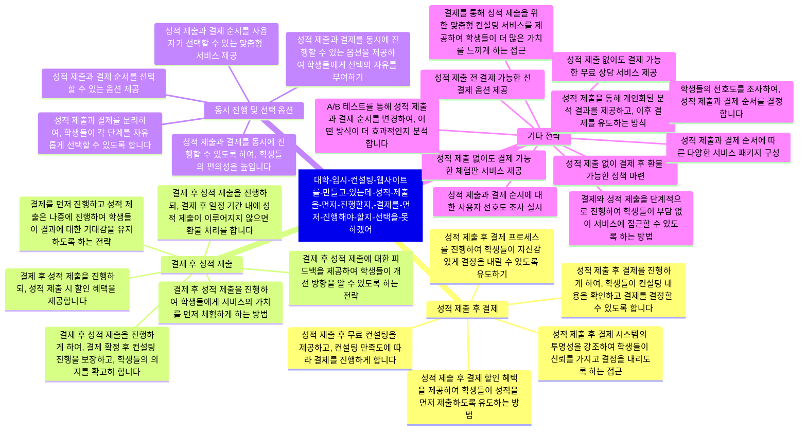
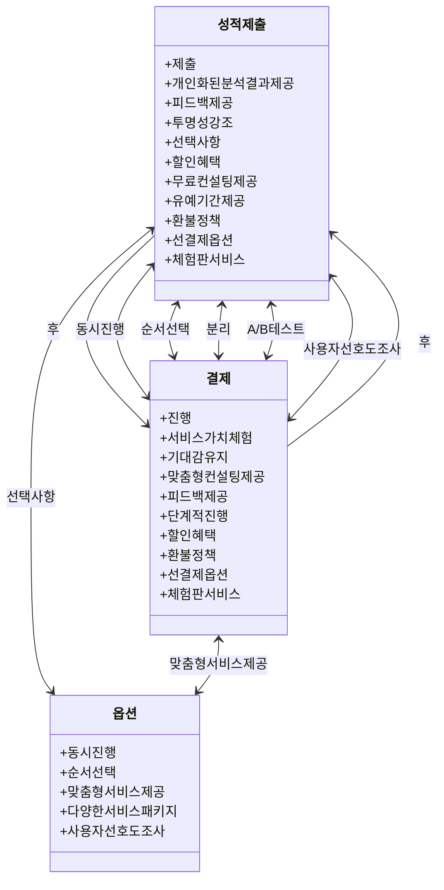

# 브레인스토밍 결과

## 설정
- 주제: 대학-입시-컨설팅-웹사이트를-만들고-있는데-성적-제출을-먼저-진행할지,-결제를-먼저-진행해야-할지-선택을-못하겠어.
- 아이디어 수: 10
- 자유도: 0.7

## 각 AI 모델이 생성한 아이디어 목록

### openai
- 성적 제출 후 결제 프로세스를 진행하여 학생들이 자신감 있게 결정을 내릴 수 있도록 유도하기.
- 결제 후 성적 제출을 진행하여 학생들에게 서비스의 가치를 먼저 체험하게 하는 방법.
- 결제를 먼저 진행하고 성적 제출은 나중에 진행하여 학생들이 결과에 대한 기대감을 유지하도록 하는 전략.
- 성적 제출과 결제를 동시에 진행할 수 있는 옵션을 제공하여 학생들에게 선택의 자유를 부여하기.
- 결제를 통해 성적 제출을 위한 맞춤형 컨설팅 서비스를 제공하여 학생들이 더 많은 가치를 느끼게 하는 접근.
- 성적 제출 후 결제 할인 혜택을 제공하여 학생들이 성적을 먼저 제출하도록 유도하는 방법.
- 결제 후 성적 제출에 대한 피드백을 제공하여 학생들이 개선 방향을 알 수 있도록 하는 전략.
- 성적 제출을 통해 개인화된 분석 결과를 제공하고, 이후 결제를 유도하는 방식.
- 결제와 성적 제출을 단계적으로 진행하여 학생들이 부담 없이 서비스에 접근할 수 있도록 하는 방법.
- 성적 제출 후 결제 시스템의 투명성을 강조하여 학생들이 신뢰를 가지고 결정을 내리도록 하는 접근.

### anthropic
- 성적 제출과 결제 순서를 선택할 수 있는 옵션 제공
- 성적 제출 후 결제 가능한 유예 기간 제공
- 성적 제출 없이도 결제 가능한 무료 상담 서비스 제공
- 성적 제출 없이 결제 후 환불 가능한 정책 마련
- 성적 제출과 결제 순서를 사용자가 선택할 수 있는 맞춤형 서비스 제공
- 성적 제출 후 결제 할인 혜택 제공
- 성적 제출 전 결제 가능한 선결제 옵션 제공
- 성적 제출과 결제 순서에 따른 다양한 서비스 패키지 구성
- 성적 제출 없이도 결제 가능한 체험판 서비스 제공
- 성적 제출과 결제 순서에 대한 사용자 선호도 조사 실시

### google
- Idea: 성적 제출 후 결제를 진행하게 하여, 학생들이 컨설팅 내용을 확인하고 결제를 결정할 수 있도록 합니다.
- Idea: 결제 후 성적 제출을 진행하게 하여, 결제 확정 후 컨설팅 진행을 보장하고, 학생들의 의지를 확고히 합니다.
- Idea: 성적 제출과 결제를 동시에 진행할 수 있도록 하여, 학생들의 편의성을 높입니다.
- Idea: 성적 제출 후 무료 컨설팅을 제공하고, 컨설팅 만족도에 따라 결제를 진행하게 합니다.
- Idea: 결제 후 성적 제출을 진행하되, 결제 후 일정 기간 내에 성적 제출이 이루어지지 않으면 환불 처리를 합니다.
- Idea: 성적 제출을 선택 사항으로 하고, 성적 제출 여부에 따라 컨설팅 내용이 달라지도록 합니다.
- Idea: 결제 후 성적 제출을 진행하되, 성적 제출 시 할인 혜택을 제공합니다.
- Idea: 성적 제출과 결제를 분리하여, 학생들이 각 단계를 자유롭게 선택할 수 있도록 합니다.
- Idea: A/B 테스트를 통해 성적 제출과 결제 순서를 변경하여, 어떤 방식이 더 효과적인지 분석합니다.
- Idea: 학생들의 선호도를 조사하여, 성적 제출과 결제 순서를 결정합니다.

## 마인드맵

## 클래스 다이어그램 (유사 KJ 기법)

## 아이디어 평가

### openai
- Overall Evaluation:
  - 성적 제출과 결제의 순서 및 방법에 대한 다양한 옵션을 제공하여 유연성을 높인 점이 긍정적이다.

- Good Points:
  - 성적 제출 후 개인화된 분석 결과와 피드백 제공으로 사용자 경험 강화.
  - 할인 혜택 및 무료 컨설팅 제공으로 고객 유치 가능성 증가.
  - 동시 진행 및 순서 선택 옵션으로 사용자 맞춤형 서비스 제공.

- Areas for Improvement:
  - 결제와 성적 제출 간의 명확한 연결성을 강화할 필요가 있음.
  - 사용자 선호도 조사를 통해 보다 정교한 서비스 개선 방안을 마련해야 함.
  - A/B 테스트 결과를 반영하여 최적의 진행 방식을 도출할 필요가 있음.

### anthropic
전반적인 평가:
- 성적 제출과 결제 간의 관계 및 옵션에 대한 다양한 고려사항이 잘 반영되어 있음
- 사용자의 선호도와 맞춤형 서비스 제공에 초점을 두고 있어 긍정적임

장점:
- 성적 제출과 결제 간의 선후관계, 동시진행, 순서 선택 등 다양한 옵션을 고려하고 있음
- 사용자 선호도 조사, A/B 테스트 등 사용자 경험 향상을 위한 방안이 포함되어 있음
- 할인 혜택, 환불 정책, 체험판 서비스 등 사용자의 니즈를 반영한 기능들이 포함되어 있음

개선 사항:
- 성적 제출과 결제 간의 관계에 대한 보다 구체적인 설명이 필요할 수 있음
- 사용자 선호도 조사 및 맞춤형 서비스 제공에 대한 구체적인 방안이 더 필요할 수 있음
- 성적 제출과 결제 간의 연계성을 높이기 위한 추가적인 기능 고려가 필요할 수 있음

### google
## 마인드맵 평가

- **Overall Evaluation**:  성적 제출과 결제의 순서에 대한 다양한 옵션을 제시하고, 각 옵션에 대한 장단점을 분석하여 이해를 돕는 마인드맵입니다. 하지만 몇 가지 개선할 부분이 있습니다.

- **Good Points**:
    - 성적 제출과 결제의 순서에 대한 다양한 옵션을 제시했습니다.
    - 각 옵션에 대한 장단점을 명확하게 표현했습니다.
    - A/B 테스트와 사용자 선호도 조사를 통해 최적의 방식을 찾을 수 있도록 제시했습니다.

- **Areas for Improvement**:
    - 각 옵션에 대한 구체적인 예시나 시나리오를 추가하면 이해도를 높일 수 있습니다.
    - 마인드맵의 시각적인 구성을 개선하여 더 직관적으로 이해할 수 있도록 만들 수 있습니다.
    - 옵션과 관련된 추가적인 고려 사항 (예: 보안, 사용자 경험, 데이터 관리)을 포함하면 더욱 완성도 높은 마인드맵이 될 수 있습니다.

