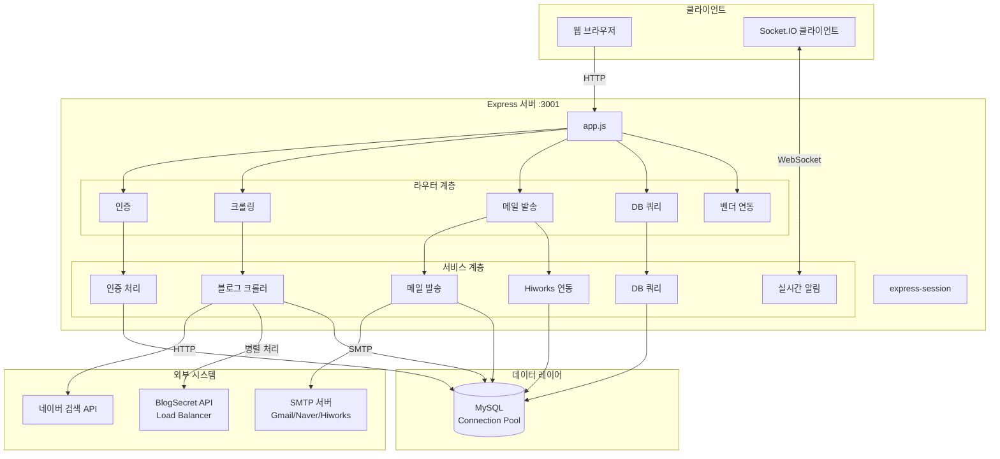
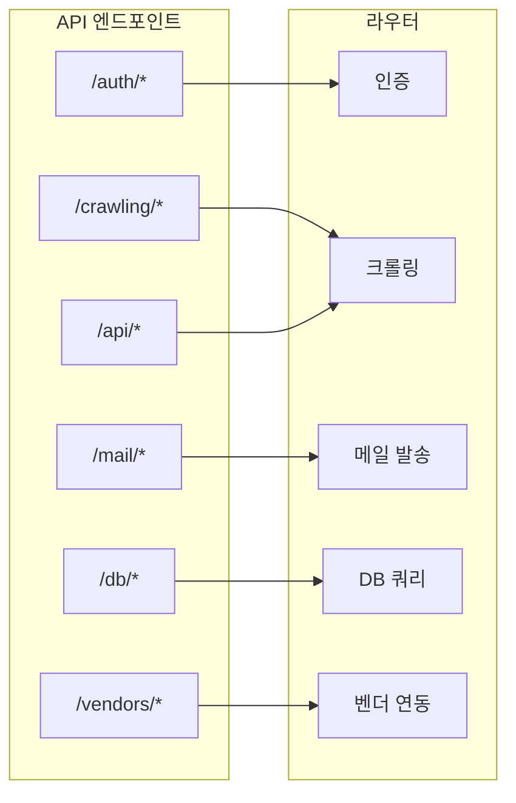
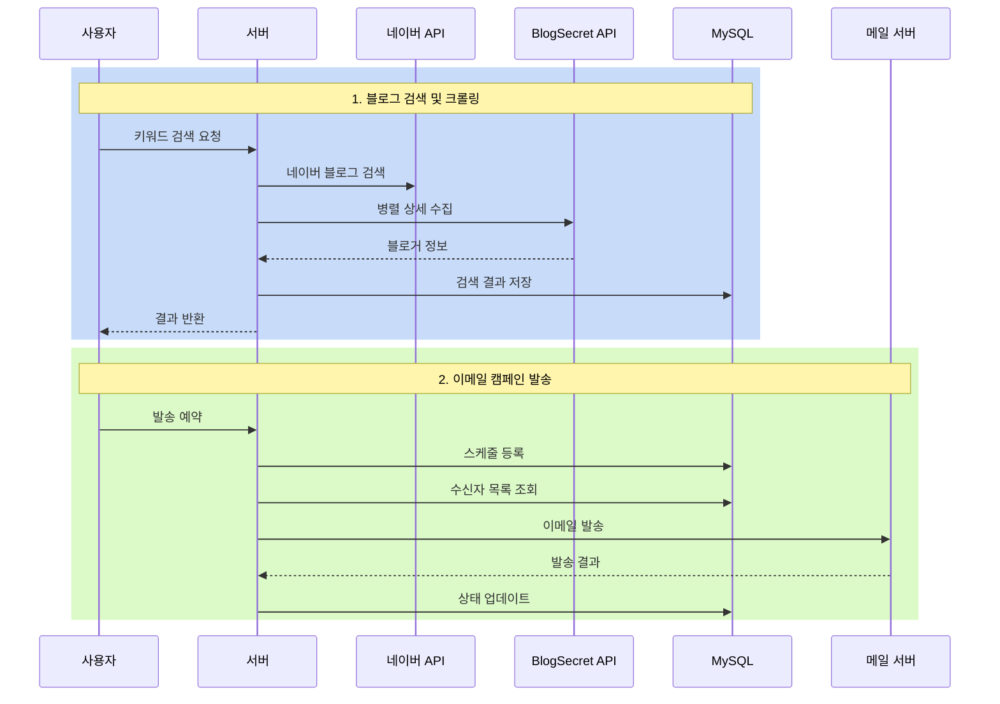

---
tags:
  - architecture
  - Nodejs
Create at: 2026-01-05
title: 시스템 개요
---

# 시스템 개요
## 1. 시스템 소개
이메일 마케팅 캠페인 관리 및 네이버 블로그 크롤링 기능을 제공하는 Node.js 기반 웹 애플리케이션

### 핵심 기능
- 네이버 블로그 검색 결과 크롤링 및 블로거 ID 추출
- 이메일 검증 및 캠페인 발송
- 실시간 진행률 모니터링
- 발신자 그룹 관리

---

## 2. 기술 스택
| 영역 | 기술 |
|------|------|
| Runtime | Node.js (ES Modules) |
| Framework | Express.js |
| Database | MySQL (mysql2/promise) |
| Template | EJS |
| Real-time | Socket.IO |
| Email | Nodemailer |
| Crawling | Axios, Cheerio |
| RPA (Hiworks 관리자 자동화) | Puppeteer |
| Scheduling | node-schedule |
| Build | Webpack |

---

## 3. 전체 시스템 아키텍처


---

## 4. 라우트 매핑


---

## 5. 주요 데이터 흐름


---

## 6. 디렉토리 구조
```dir
renamailer/
├── app.js                 # 메인 엔트리포인트
├── config/
│   ├── dbConfig.js        # MySQL 연결 설정
│   ├── logger.js          # Winston 로깅
│   └── config.env         # 환경 변수
├── routes/
│   ├── auth-router.js     # 인증 라우터
│   ├── crawl-router.js    # 크롤링 라우터
│   ├── crawling.js        # 크롤링 보조
│   ├── db-router.js       # DB 쿼리 라우터
│   ├── mail-router.js     # 메일 라우터
│   └── vendors-router.js  # 벤더 라우터
├── models/
│   ├── auth-service.js    # 인증 서비스
│   ├── doSearchService.js # 크롤링 서비스
│   ├── mail-service.js    # 메일 서비스
│   ├── query-service.js   # 쿼리 서비스
│   ├── socketService.js   # 소켓 서비스
│   └── hiworksService.js  # 하이웍스 연동
├── views/                 # EJS 템플릿
├── public/                # 정적 파일
└── dist/                  # Webpack 빌드 결과
```

---

## 7. 환경 설정
| 변수 | 용도 |
|------|------|
| `BLOG_SECRET_API_URL` | BlogSecret API Load Balancer URL |
| `USE_PARALLEL_API` | 병렬 처리 활성화 여부 |
| `MAX_CONCURRENT_REQUESTS` | 동시 요청 제한 (기본값: 10) |
| `MAIL_HOSTINFO` | SMTP 호스트 |
| `MAIL_PORTINFO` | SMTP 포트 |
| `LOGIN_PASSWORD_LENGTH` | 로그인 비밀번호 길이 |

---

## 8. 관련 문서
- [02-layer-architecture.md](./02-layer-architecture.md) - 레이어별 상세 구조
- [03-crawling-flow.md](./03-crawling-flow.md) - 웹 크롤링 상세 흐름
- [04-email-campaign-flow.md](./04-email-campaign-flow.md) - 이메일 캠페인 상세
- [05-auth-flow.md](./05-auth-flow.md) - 인증 흐름 상세
