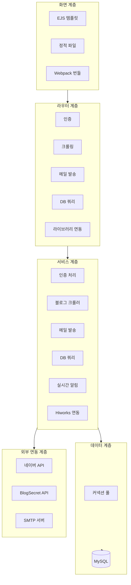
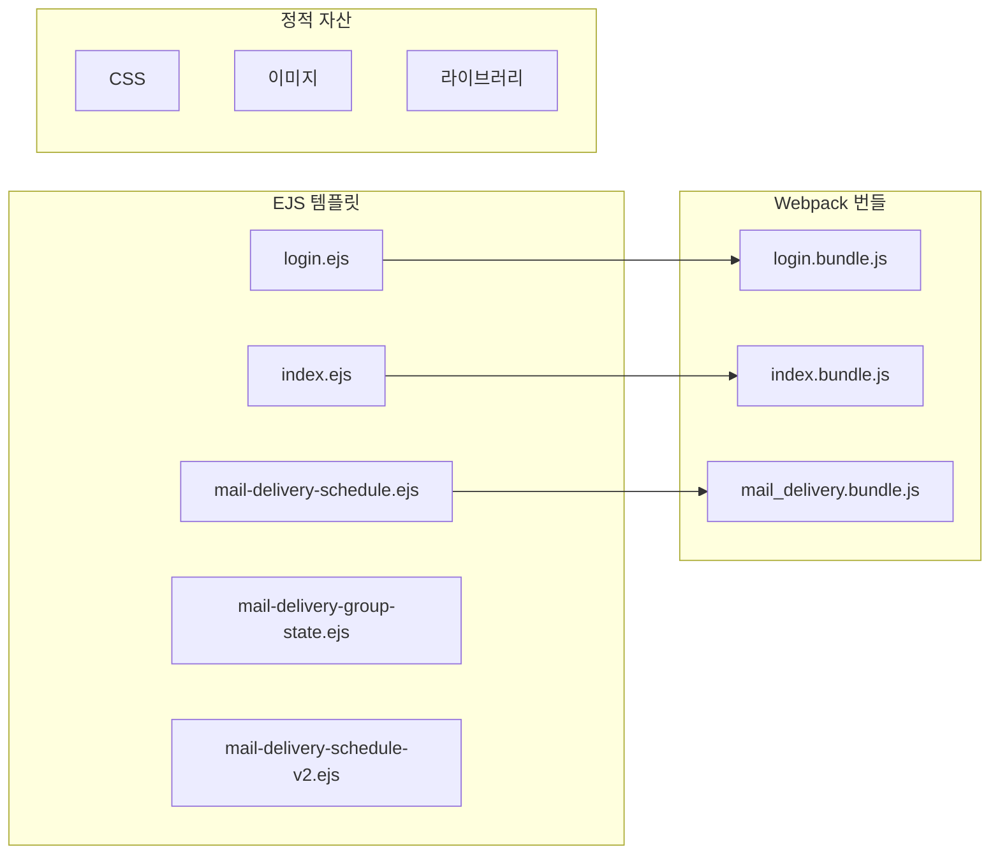
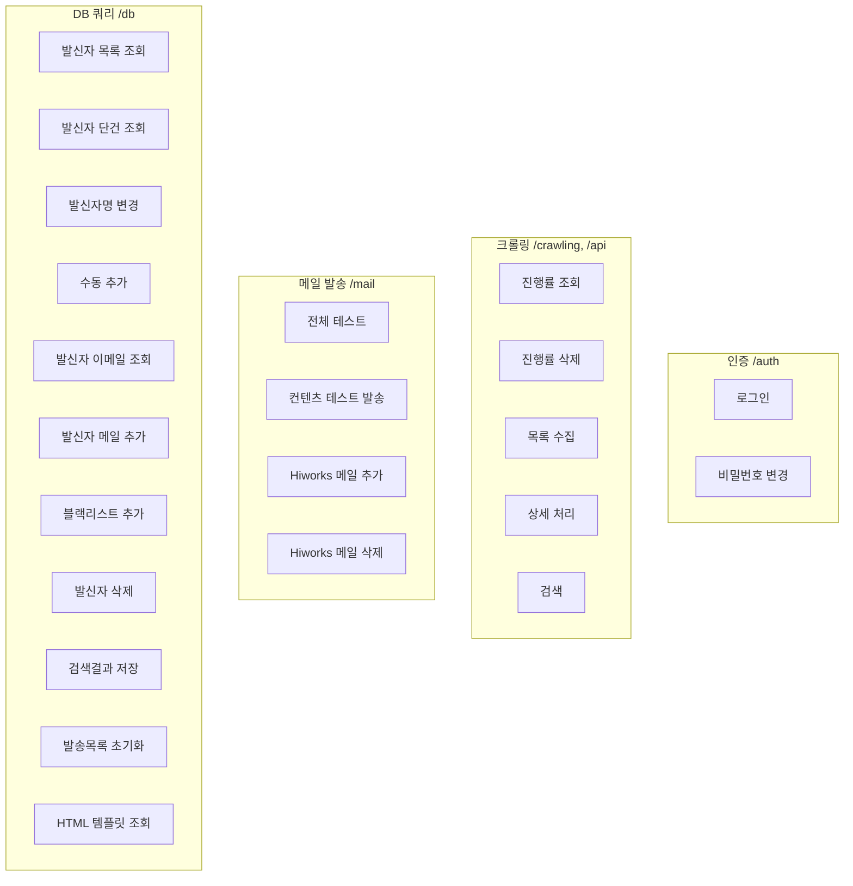
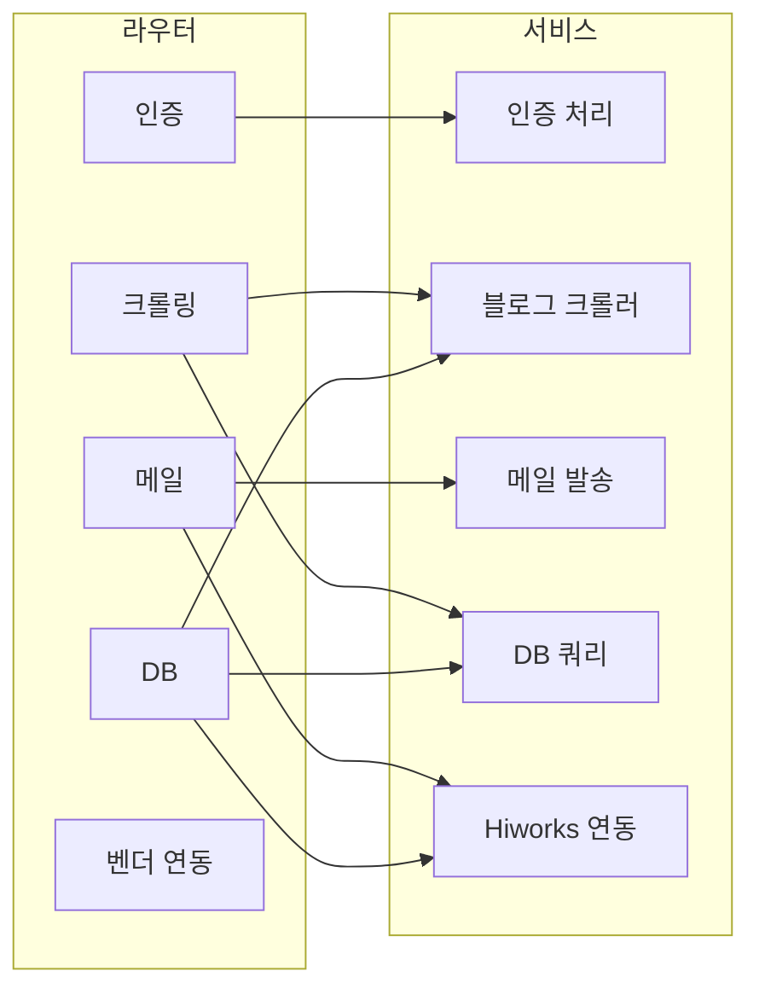
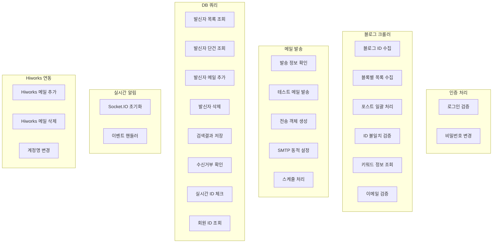
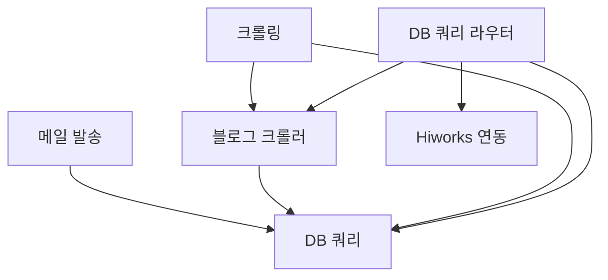
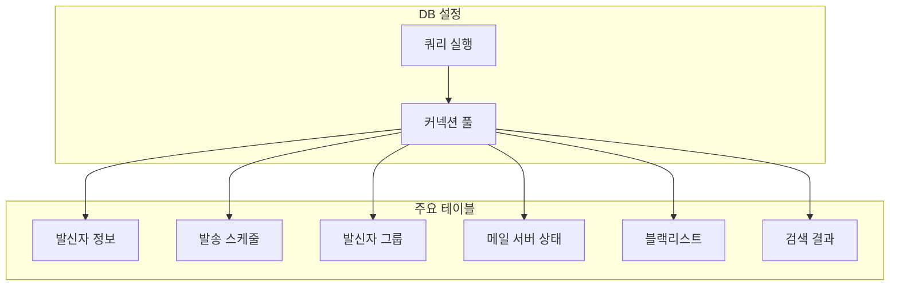
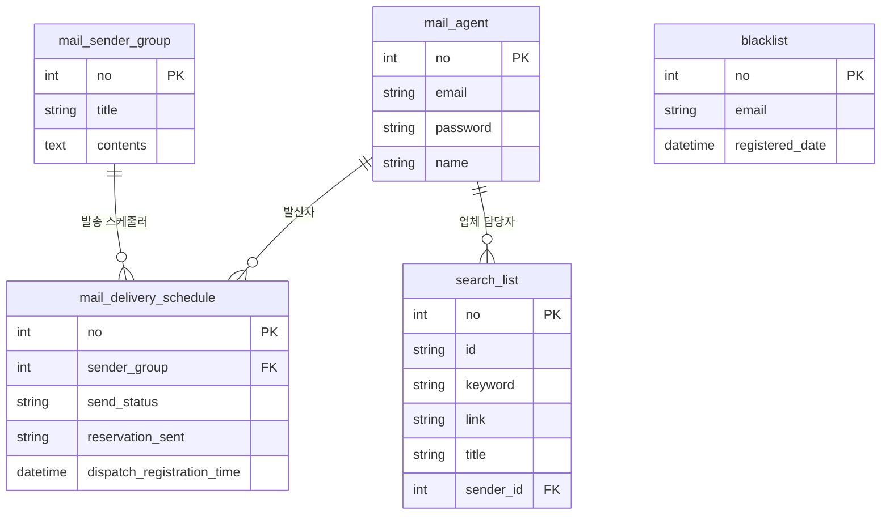
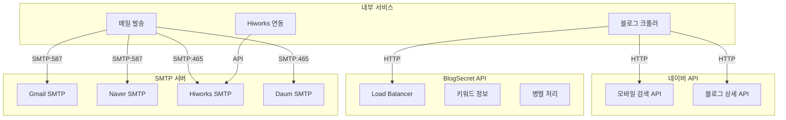
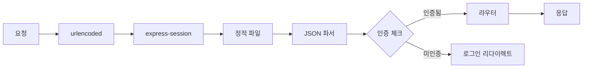

# 레이어별 아키텍처

## 1. 아키텍처 개요

---

## 2. Presentation Layer
### 뷰 구조

### 페이지 접근 권한
| 페이지 | 경로 | 인증 필요 |
|--------|------|----------|
| 로그인 | `/login` | X |
| 대시보드 | `/` | O |
| 메일 스케줄 | `/mail-delivery-schedule` | O |
| 그룹 상태 | `/mail-delivery-group-state` | O |
| 스케줄 V2 | `/mail-delivery-schedule-v2` | O |

---

## 3. Router Layer
### 라우터 상세 구조

### 라우터 - 서비스 의존성

---

## 4. Service Layer
### 서비스 책임 분리

### 서비스 간 의존성

---

## 5. Data Layer
### 데이터베이스 연결 구조

### 테이블 관계도

---

## 6. External Layer
### 외부 시스템 연동

### SMTP 동적 설정
| 도메인 | 호스트 | 포트 | 보안 |
|--------|--------|------|------|
| gmail.com | smtp.gmail.com | 587 | TLS |
| naver.com | smtp.naver.com | 587 | STARTTLS |
| daum.net | smtp.daum.net | 465 | TLS |
| 기타 | smtps.hiworks.com | 465 | TLS |

---

## 7. 미들웨어 체인

---

## 8. 관련 문서
- [01-system-overview.md](./01-system-overview.md) - 시스템 전체 개요
- [03-crawling-flow.md](./03-crawling-flow.md) - 웹 크롤링 상세 흐름
- [04-email-campaign-flow.md](./04-email-campaign-flow.md) - 이메일 캠페인 상세
- [05-auth-flow.md](./05-auth-flow.md) - 인증 흐름 상세
