# 웹 크롤링 상세 흐름
## 1. 크롤링 시스템 개요
네이버 블로그 검색 결과에서 블로거 정보를 수집하고 이메일을 검증하는 시스템

### 핵심 구성요소
- **크롤링 라우터**: API 엔드포인트 정의
- **블로그 크롤러**: 크롤링 비즈니스 로직
- **이메일 검증기**: 이메일 유효성 검증 유틸리티

---

## 2. 전체 크롤링 흐름
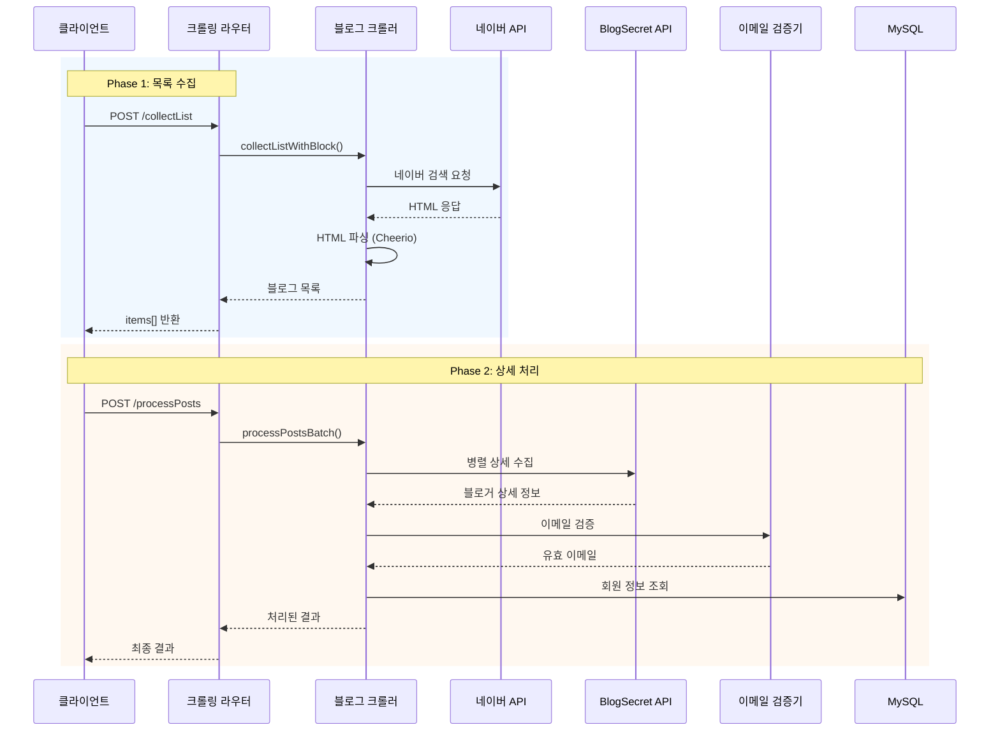

---

## 3. 목록 수집 단계 (collectList)
### 3.1 API 엔드포인트
```js
POST /crawling/collectList
```

**요청 파라미터:**

| 필드 | 타입 | 설명 |
|------|------|------|
| tasks | Array | 키워드/블록/페이지 정보 |
| score1 | Number | 점수 기준 1 |
| score2 | Number | 점수 기준 2 |
| sessionId | String | 진행률 추적용 세션 ID |

### 3.2 처리 흐름
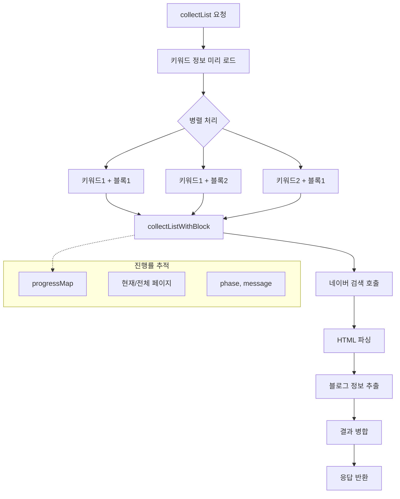

### 3.3 동시성 제어
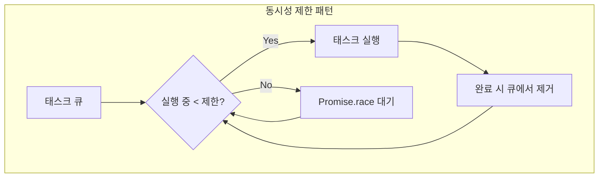

**설정값:**

- `MAX_CONCURRENT_REQUESTS`: 10 (동시 요청 제한)
- `MAX_PAGES_PER_BLOCK`: 5 (블록당 최대 페이지)

---

## 4. 상세 처리 단계 (processPosts)
### 4.1 API 엔드포인트
```js
POST /crawling/processPosts
```

**요청 파라미터:**

| 필드 | 타입 | 설명 |
|------|------|------|
| items | Array | 수집된 블로그 목록 |
| sessionId | String | 진행률 추적용 세션 ID |

### 4.2 처리 흐름
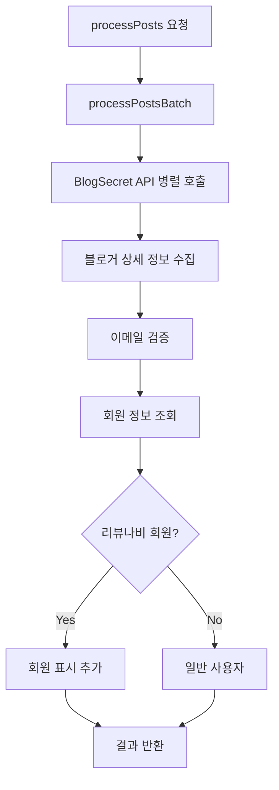

### 4.3 회원 체크 로직
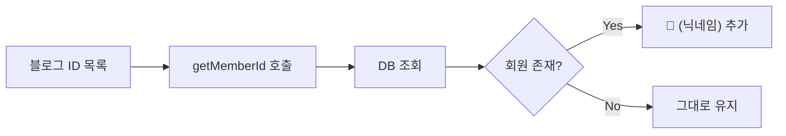

---

## 5. 검색 API (search)
### 5.1 API 엔드포인트
```js
POST /crawling/search
```

### 5.2 처리 흐름
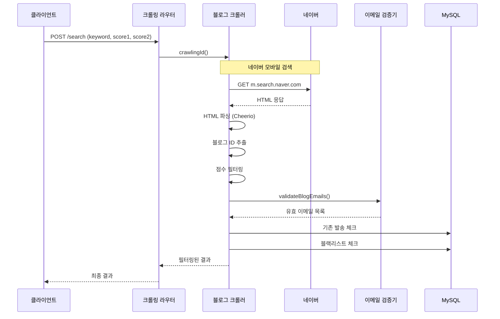

---

## 6. 네이버 크롤링 상세
### 6.1 검색 URL 구성
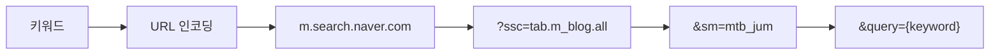

### 6.2 HTML 파싱 셀렉터
| 셀렉터 | 추출 대상 |
|--------|----------|
| `.user_info a` | 사용자 정보 |
| `.title_area a` | 포스팅 제목/URL |
| `.dsc_area a` | 설명 영역 |
| `data-cb-target` | 고유 ID (gdid) |

### 6.3 User-Agent 로테이션
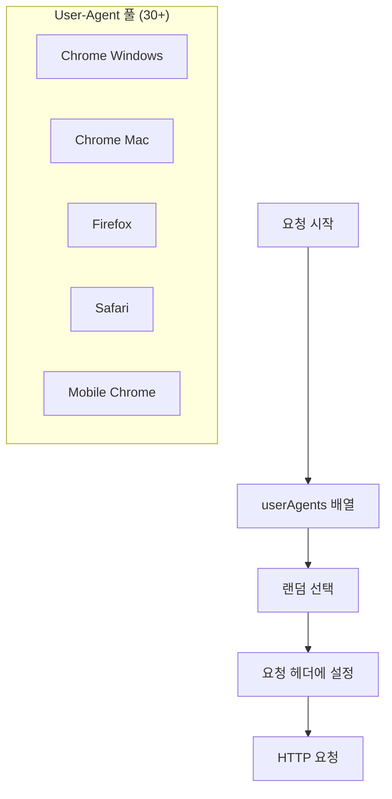

---

## 7. 진행률 추적
### 7.1 진행률 API
```js
GET /crawling/progress/:sessionId
DELETE /crawling/progress/:sessionId
```

### 7.2 진행률 데이터 구조
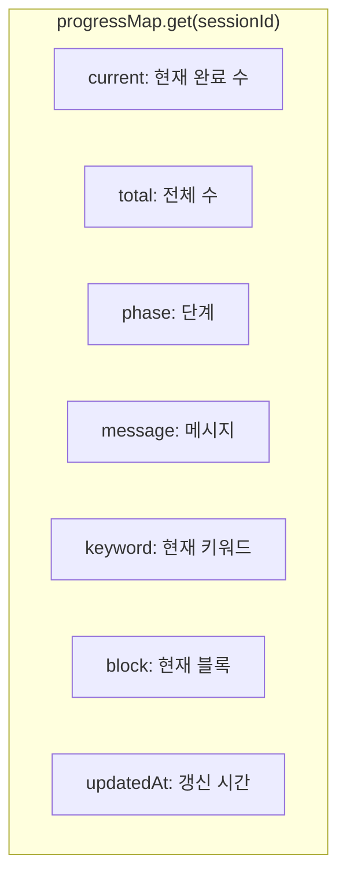

### 7.3 Phase 상태
| Phase | 설명 |
|-------|------|
| waiting | 대기 중 |
| list-collecting | 목록 수집 중 |
| list-complete | 목록 수집 완료 |
| processing | 상세 처리 중 |
| complete | 전체 완료 |

---

## 8. BlogSecret API 연동
### 8.1 API 구조
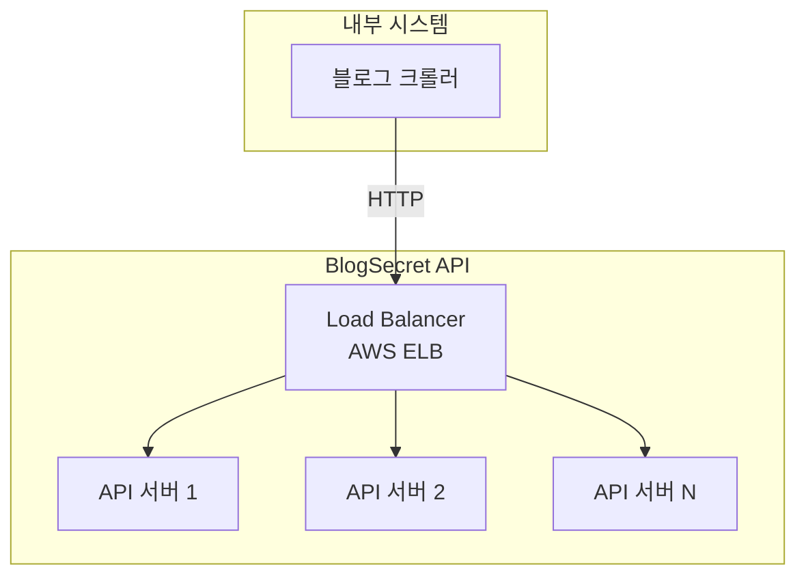

### 8.2 환경 설정
```js
BLOG_SECRET_API_URL=http://BlogSecretAPI-LoadBalancer-*.elb.amazonaws.com
USE_PARALLEL_API=true
```

---

## 9. 에러 처리
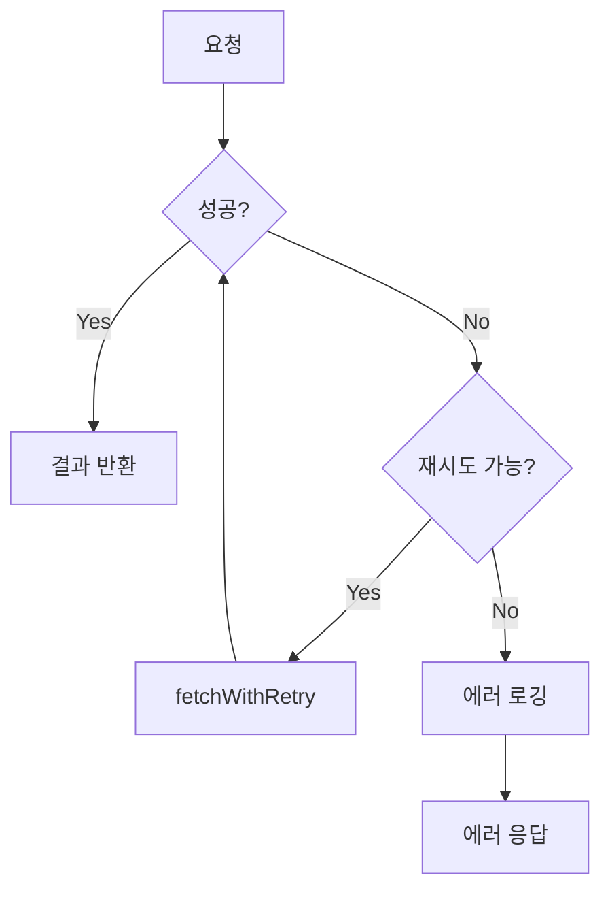

---

## 10. 관련 문서
- [01-system-overview.md](./01-system-overview.md) - 시스템 전체 개요
- [02-layer-architecture.md](./02-layer-architecture.md) - 레이어별 상세 구조
- [04-email-campaign-flow.md](./04-email-campaign-flow.md) - 이메일 캠페인 상세
- [05-auth-flow.md](./05-auth-flow.md) - 인증 흐름 상세
