# 이메일 캠페인 상세 흐름

## 1. 이메일 시스템 개요
Nodemailer 기반의 다중 SMTP 지원 이메일 발송 시스템

### 핵심 구성요소
- **메일 라우터**: 메일 API 엔드포인트
- **메일 발송**: 메일 발송 비즈니스 로직
- **Hiworks 연동**: 하이웍스 메일 계정 관리
- **DB 쿼리**: 발신자/수신자 DB 관리

---

## 2. 전체 이메일 발송 흐름
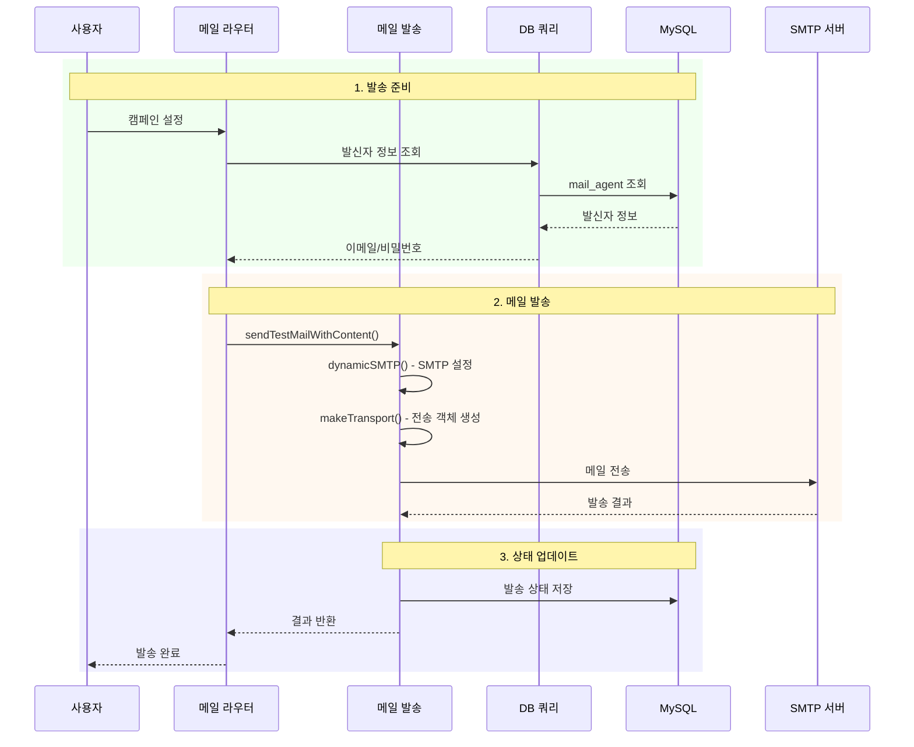

---

## 3. 발신자 관리
### 3.1 발신자 구조
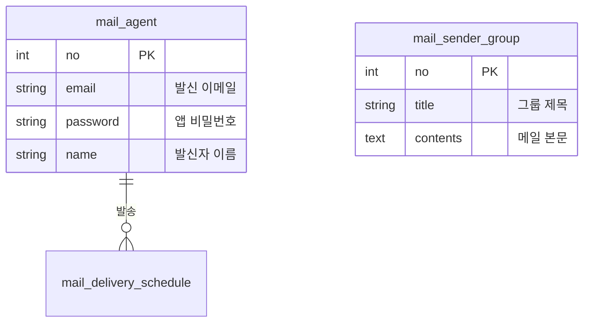

### 3.2 발신자 API
| 엔드포인트 | 설명 |
|-----------|------|
| POST /db/getSender | 전체 발신자 목록 조회 |
| POST /db/getOneSender | 특정 발신자 조회 |
| POST /db/addSenderMail | 새 발신자 추가 |
| POST /db/deleteSender | 발신자 삭제 |
| POST /db/changeSenderName | 발신자 이름 변경 |

---

## 4. SMTP 동적 설정
### 4.1 SMTP 선택 로직
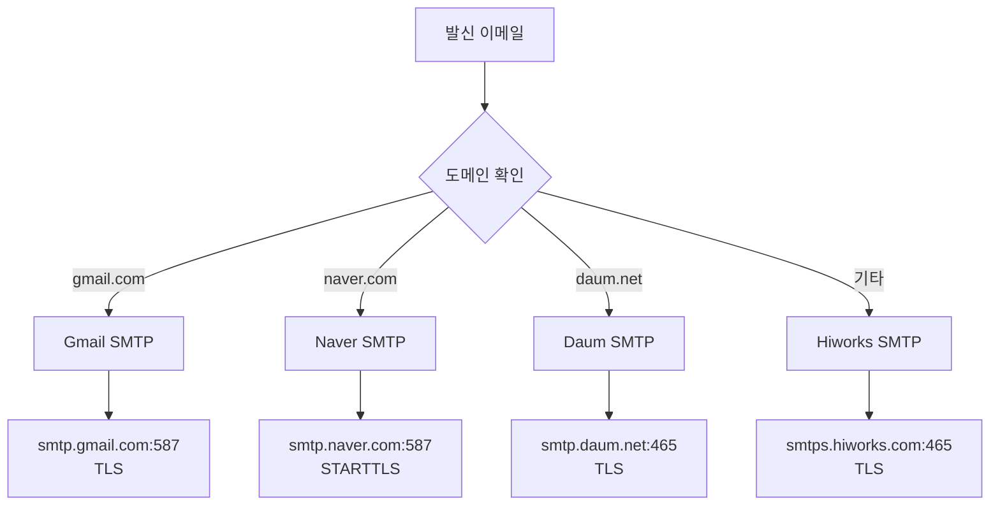

### 4.2 SMTP 설정 상세
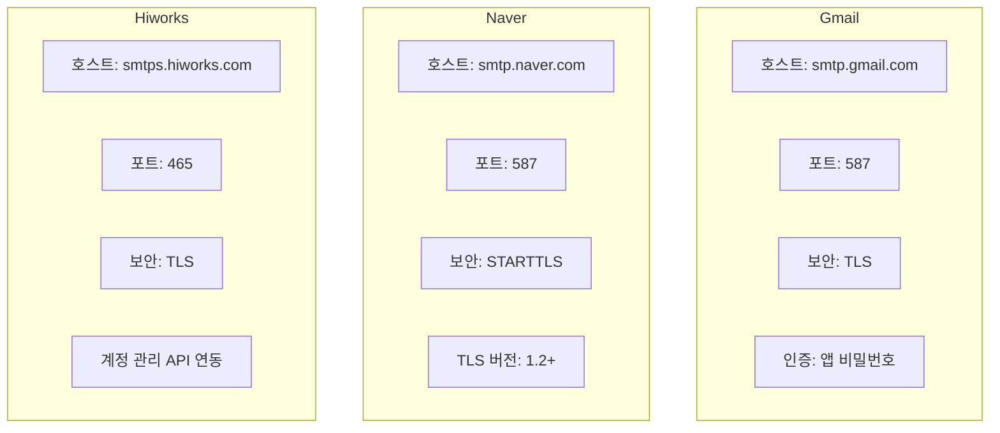

---

## 5. 메일 발송 상세
### 5.1 테스트 발송 API
```js
POST /mail/sendTestWithContent
```

**요청 파라미터:**

| 필드 | 타입 | 필수 | 설명 |
|------|------|------|------|
| senderId | Number | O | 발신자 번호 |
| testId | String | O | 테스트 수신 이메일 |
| senderName | String | O | 발신자 표시 이름 |
| subject | String | O | 메일 제목 |
| body | String | O | 메일 본문 (HTML) |
| senderGroup | Number | - | 발신자 그룹 |

### 5.2 발송 프로세스
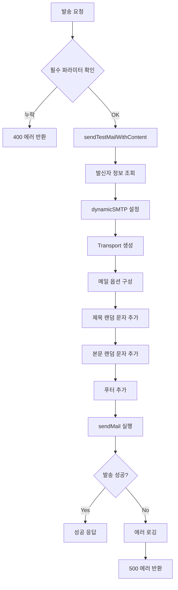

---

## 6. 메일 본문 처리
### 6.1 본문 가공 기법
> ⚠️ **대외비** - 상세 구현 내용 비공개

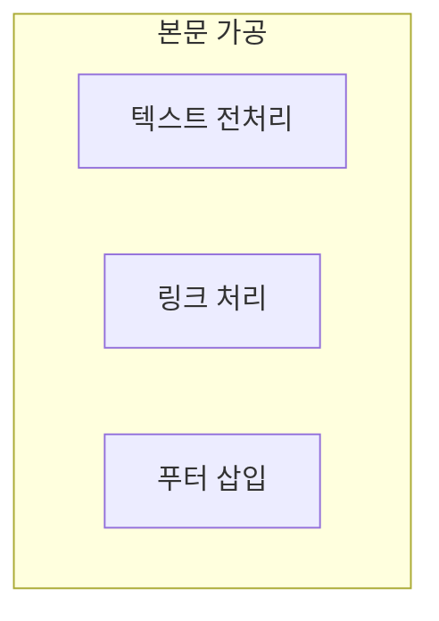

### 6.2 푸터 구조
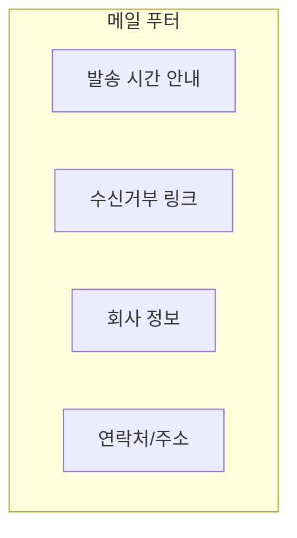

---

## 7. 스케줄 발송
### 7.1 발송 상태
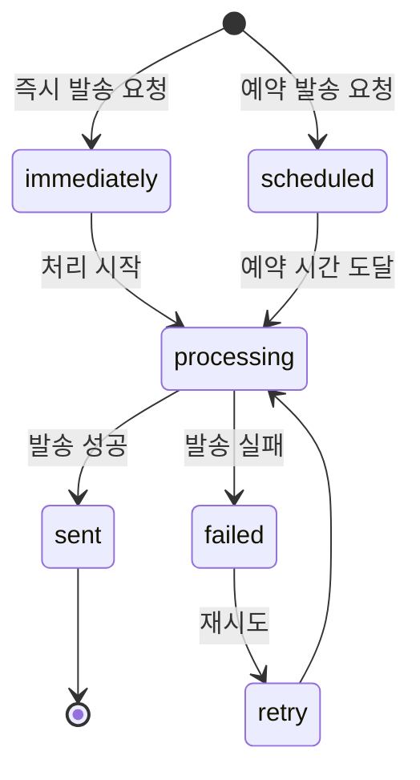

### 7.2 스케줄 쿼리
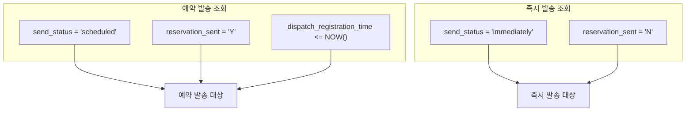

---

## 8. Hiworks 연동
### 8.1 Hiworks API
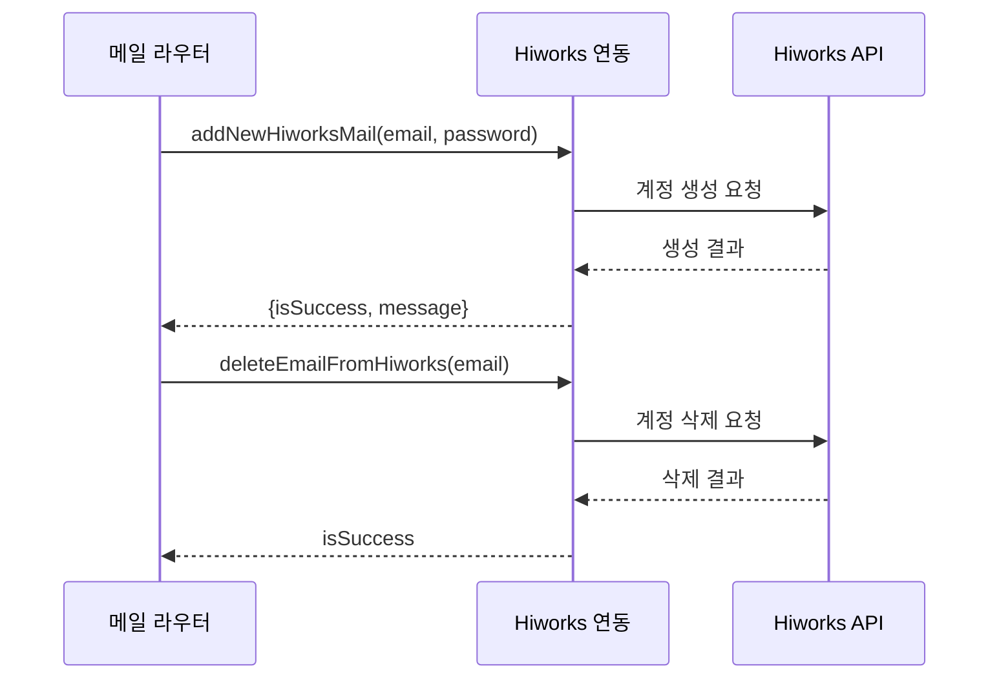

### 8.2 Hiworks API 엔드포인트
| 엔드포인트 | 설명 |
|-----------|------|
| POST /mail/addNewHiworksMail | 새 Hiworks 메일 계정 추가 |
| POST /mail/deleteEmailFromHiworks | Hiworks 메일 계정 삭제 |

---

## 9. 수신자 관리
### 9.1 수신자 필터링
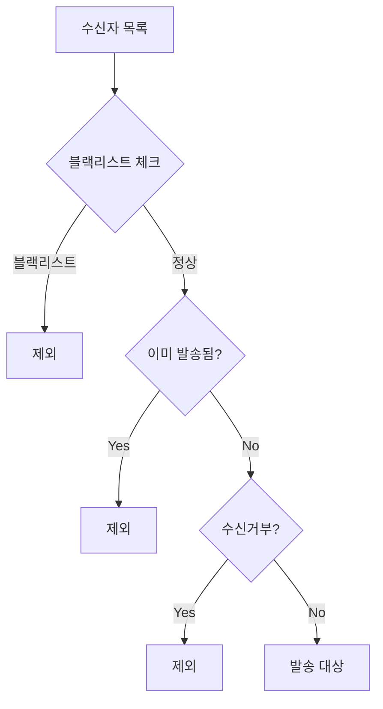

### 9.2 관련 API
| 엔드포인트 | 설명 |
|-----------|------|
| POST /db/addBlackList | 블랙리스트 추가 |
| POST /db/addManual | 수동 수신자 추가 (중복/블랙리스트 체크) |
| POST /db/InsertSearchlist | 검색 결과를 발송 목록에 추가 |
| POST /db/sendListClear | 발송 목록 초기화 |

---

## 10. 실시간 상태 업데이트
### 10.1 Socket.IO 이벤트
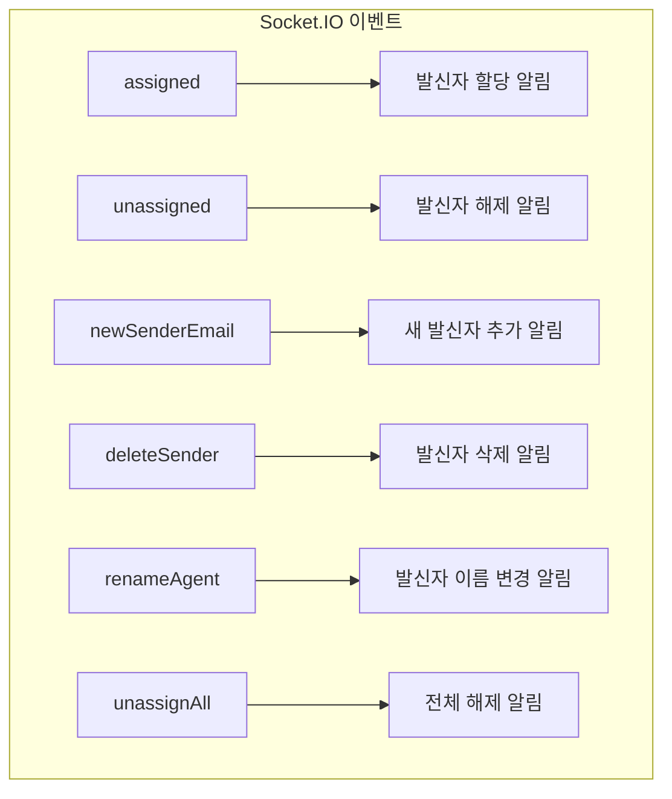

### 10.2 이벤트 흐름
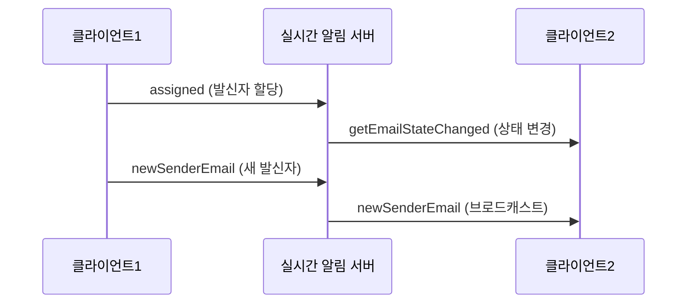

---

## 11. 에러 처리
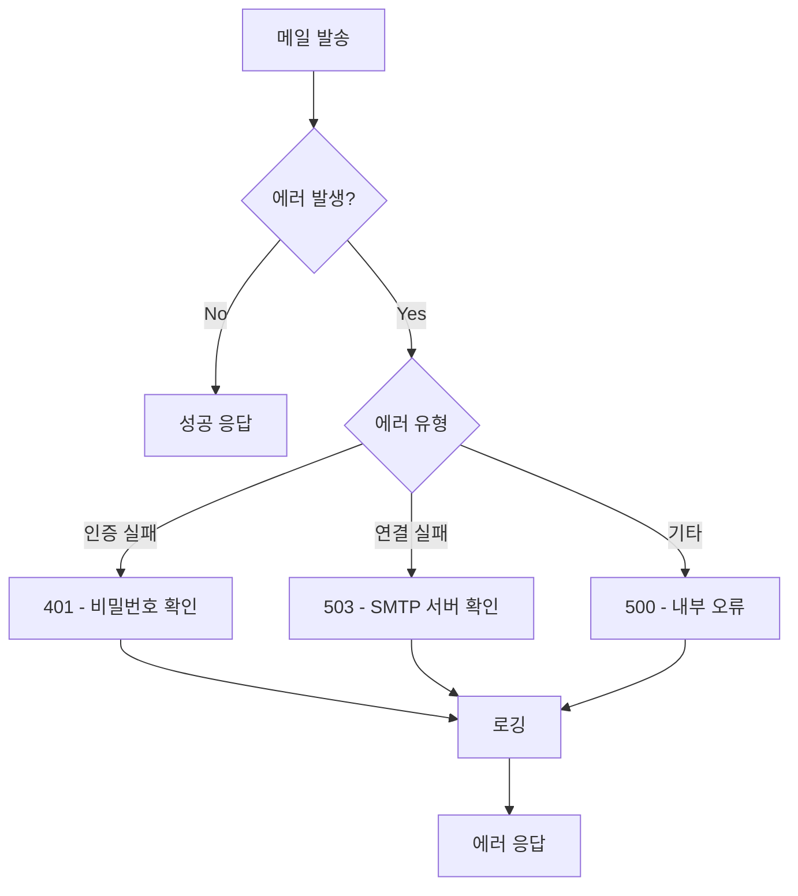

---

## 12. 관련 문서
- [01-system-overview.md](./01-system-overview.md) - 시스템 전체 개요
- [02-layer-architecture.md](./02-layer-architecture.md) - 레이어별 상세 구조
- [03-crawling-flow.md](./03-crawling-flow.md) - 웹 크롤링 상세 흐름
- [05-auth-flow.md](./05-auth-flow.md) - 인증 흐름 상세
