# 인증 흐름 상세

## 1. 인증 시스템 개요
express-session 기반의 세션 인증 시스템

### 핵심 구성요소
- **메인 앱**: 세션 미들웨어 및 인증 체크
- **인증 라우터**: 인증 API 엔드포인트
- **인증 서비스**: 인증 비즈니스 로직

---

## 2. 세션 구성
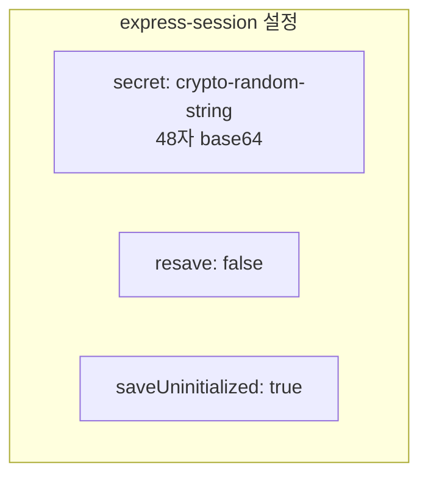

### 세션 저장소
- 기본 메모리 저장소 사용
- 서버 재시작 시 세션 초기화

---

## 3. 인증 흐름
### 3.1 로그인 흐름
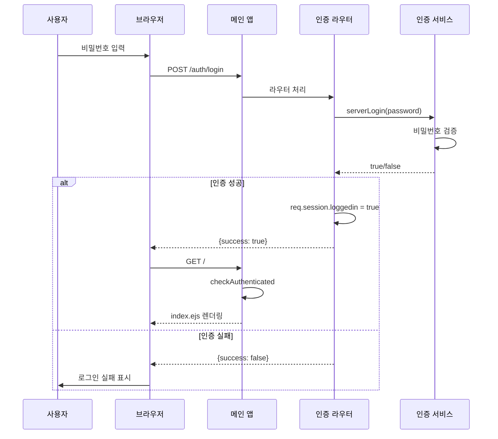

### 3.2 인증 체크 미들웨어
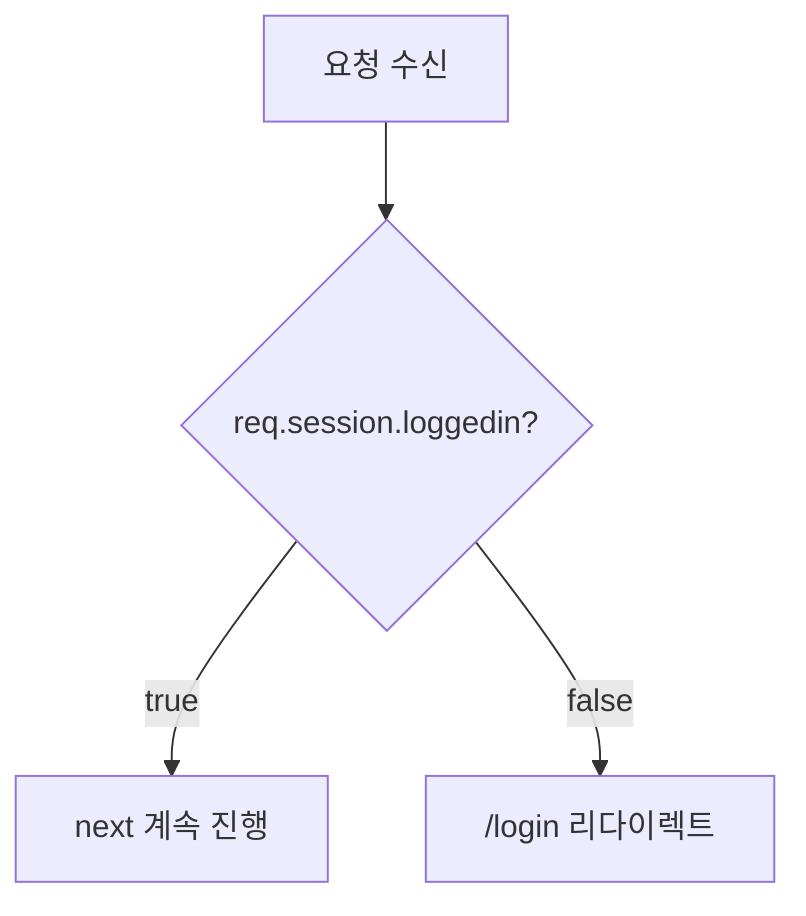

---

## 4. API 엔드포인트
### 4.1 로그인 API
```js
POST /auth/login
```

**요청:**

```json
{
  "password": "string"
}
```

**응답:**

```json
{
  "success": true | false
}
```

### 4.2 비밀번호 변경 API
```js
POST /auth/changePassword
```

**요청:**

```json
{
  "currentPw": "string",
  "newPw": "string"
}
```

### 4.3 로그아웃 API
```js
POST /logout
```

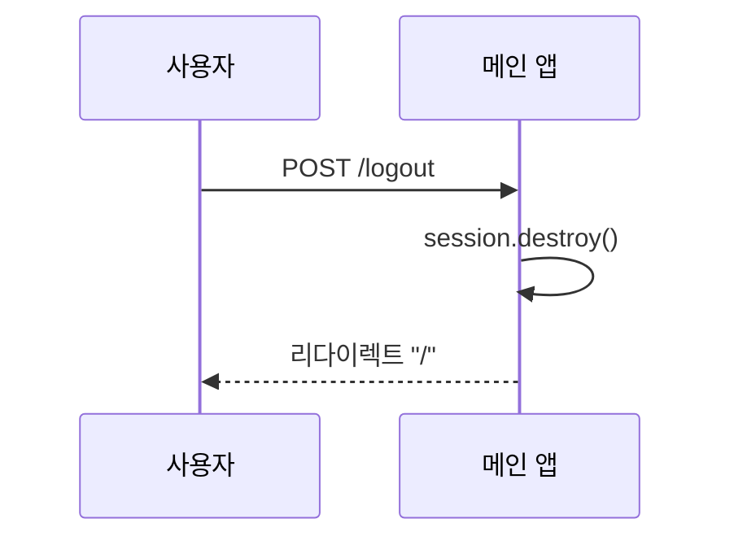

---

## 5. 페이지 보호
### 5.1 보호 대상 페이지
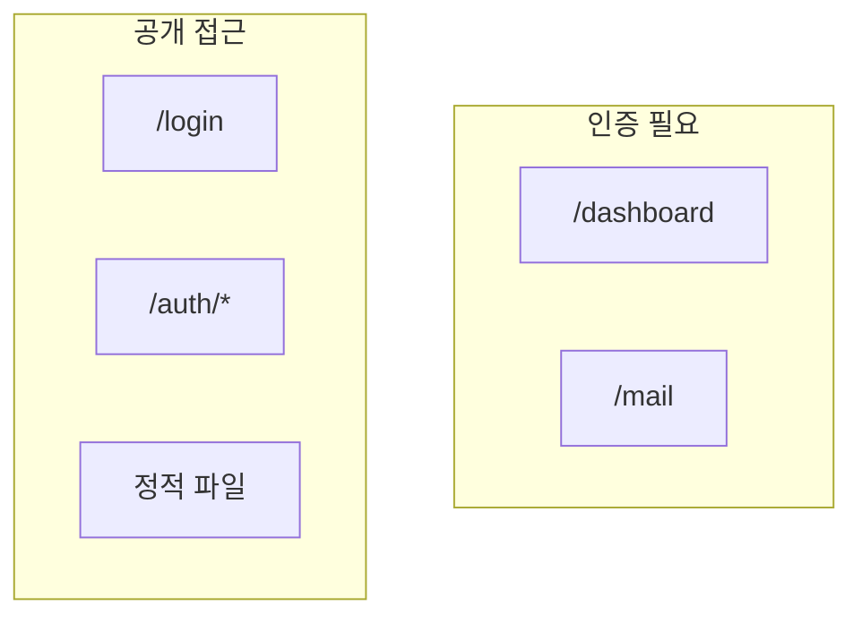

### 5.2 접근 제어 흐름
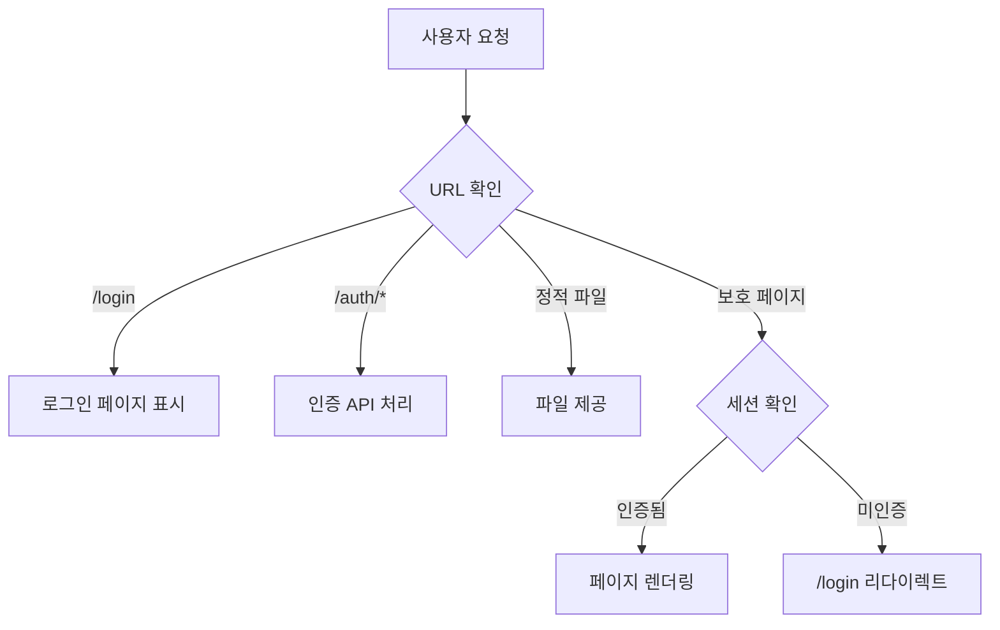

---

## 6. 로그인 페이지
### 6.1 페이지 렌더링
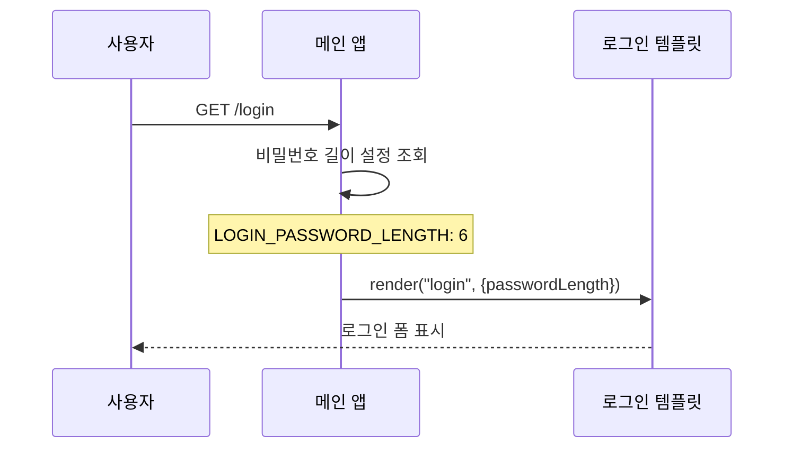

### 6.2 환경 설정
| 변수 | 설명 | 기본값 |
|------|------|--------|
| LOGIN_PASSWORD_LENGTH | 비밀번호 입력 필드 길이 | 6 |

---

## 7. 세션 관리
### 7.1 세션 생명주기
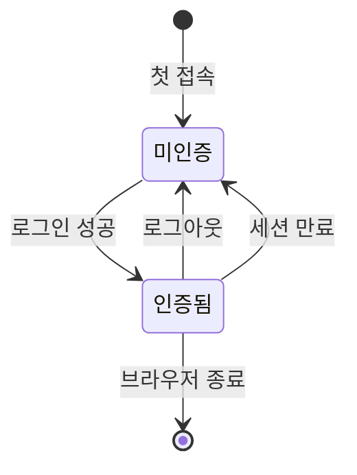

### 7.2 세션 데이터
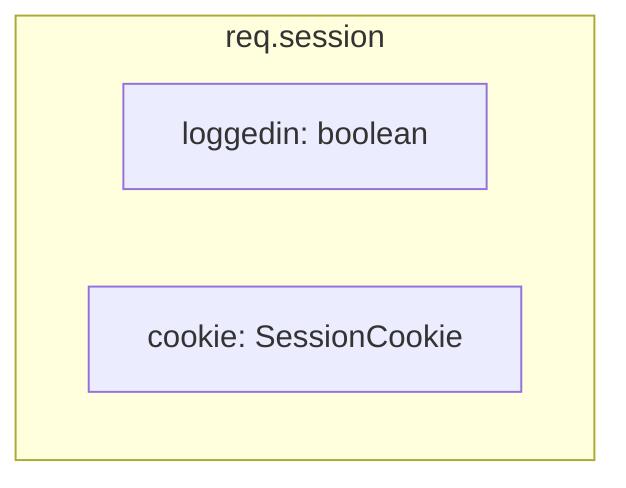

---

## 8. 보안 고려사항
### 8.1 현재 구현
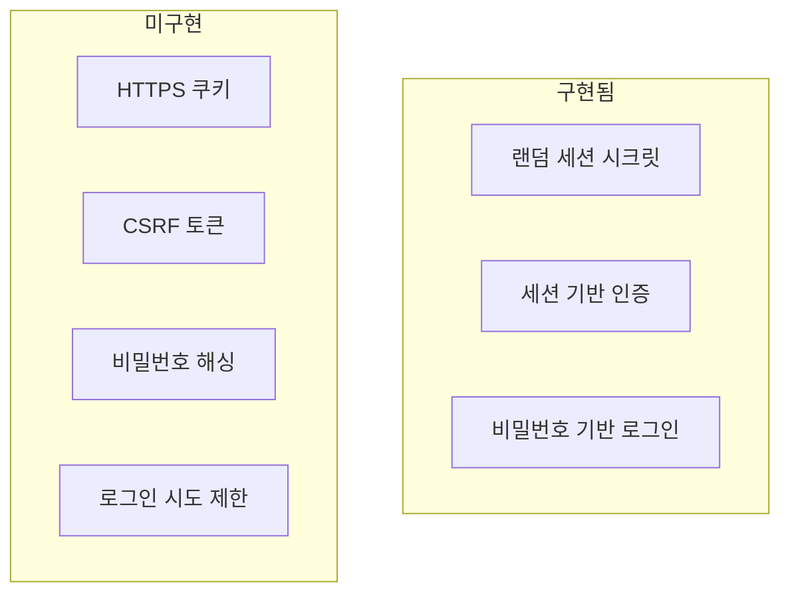

### 8.2 세션 시크릿 생성
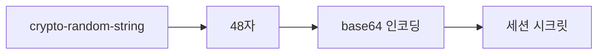

---

## 9. 에러 처리
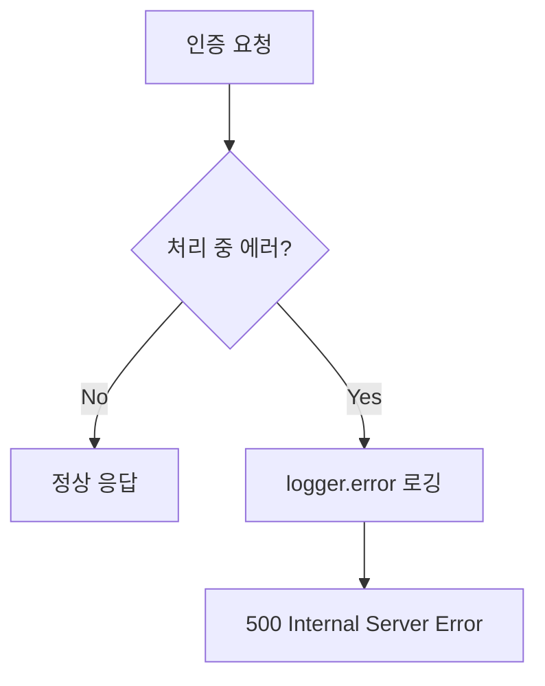

---

## 10. 코드 구조
### 10.1 인증 라우터
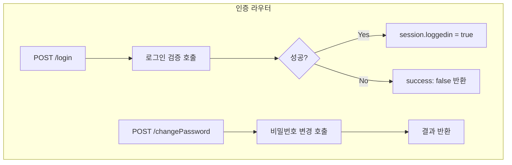

### 10.2 인증 서비스
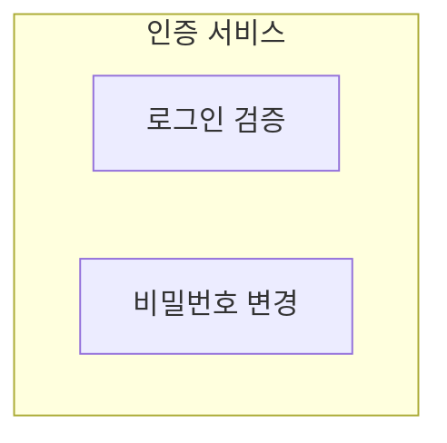

---

## 11. 통합 흐름도
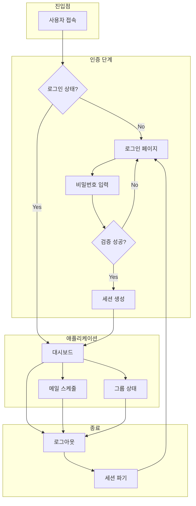

---

## 12. 관련 문서
- [01-system-overview.md](./01-system-overview.md) - 시스템 전체 개요
- [02-layer-architecture.md](./02-layer-architecture.md) - 레이어별 상세 구조
- [03-crawling-flow.md](./03-crawling-flow.md) - 웹 크롤링 상세 흐름
- [04-email-campaign-flow.md](./04-email-campaign-flow.md) - 이메일 캠페인 상세
