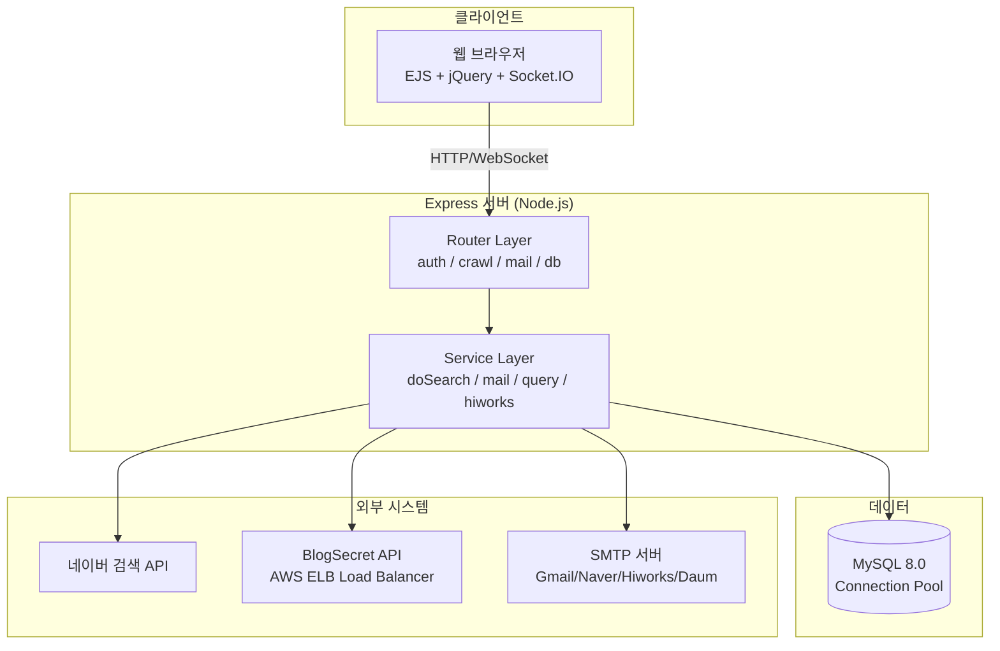
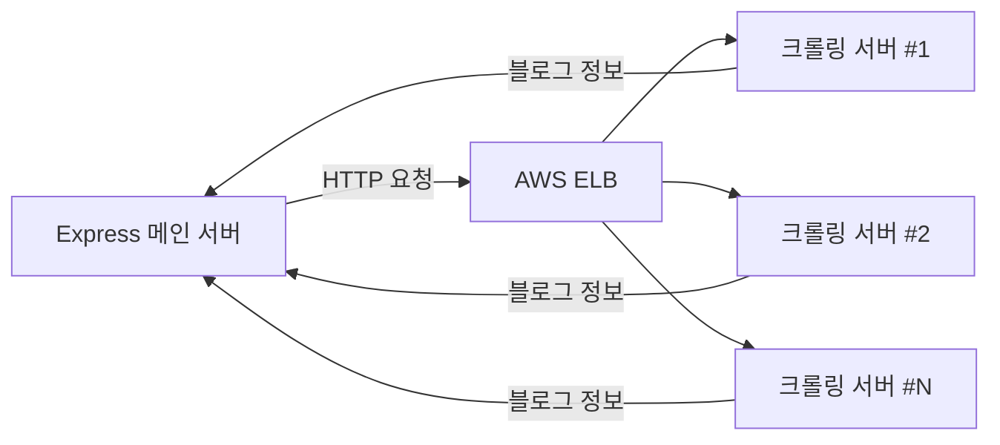

---
tags:
  - portfolio
Create at: 2025-12-18 
---

# 네이버 인플루언서 마케팅 플랫폼
**프로젝트 기간**: 2022.12 ~ 2025.12 (3 년, 지속 운영)
**개발 규모**: 100% 단독 개발 (풀스택)
**핵심 성과**: 시간당 1,200 건 안정적 발송 / 3 년간 무장애 운영

---

## 1. 프로젝트 개요
### 비즈니스 문제
네이버에는 1,500 만 개 이상의 블로그가 있지만,

특정 키워드에서 **상위노출을 유지하는 인플루언서는 극소수**입니다.

광고주는 이들을 찾기 어렵고, 인플루언서는 광고 기회를 놓칩니다.

### 솔루션
1. **빅데이터 수집**: 네이버 검색 결과에서 상위노출 이력 자동 수집
2. **확률 분석**: 카테고리별 노출 지수 분석
3. **타겟 발송**: 일정 확률 이상 인플루언서에게 이메일 발송
4. **매칭**: 광고주 ↔ 고품질 인플루언서 연결

---

## 2. 시스템 아키텍처
### 전체 구성도


### 핵심 설계 결정
| 항목 | 선택 | 이유 |
|------|------|------|
| **발송 제한** | 시간당 1,200 건 | 네이버 스팸 필터 회피 (3 초 간격 발송) |
| **분산 처리** | DB 폴링 방식 | 메시지 큐 없이 서버 선형 확장 가능 |
| **크롤링 확장** | AWS ELB 분산 | 단일 서버 대비 약 3 배 속도 향상 |
| **동시성 제어** | 최대 10 건 병렬 | 리소스 효율과 속도의 최적 균형점 |

**핵심 수치**:
- 단일 서버 기준: **시간당 1,200 건** (20 건/분, 3 초 간격)
- 서버 5 대 운영 시: **시간당 6,000 건** 선형 확장 가능
- 크롤링 속도: **30~60 초 → 5~15 초** (3 배 향상)

---

## 3. 핵심 기술적 과제
### 과제 1: 분산 환경에서 중복 발송 방지
#### 문제 (Problem)
- 여러 발송 서버가 동시에 같은 이메일을 가져가서 중복 발송될 위험
- 네이버는 중복 발송 시 즉시 스팸 차단

#### 원인 (Root Cause)
- 초기 요구사항: " 시간당 1,200 건 이상 " 처리 필요
- 제한된 서버 자원으로 인한 수평 확장 필요성
- 메시지 큐 도입 시 인프라 복잡도 증가 및 비용 부담

#### 해결 (Solution)
**DB 폴링 + FOR UPDATE 락 전략**

```sql
-- 3초마다 각 서버가 실행
SELECT * FROM mail_delivery_schedule 
WHERE send_status IN ('scheduled', 'immediately') 
  AND reservation_sent = 'Y'
  AND dispatch_registration_time <= NOW()
LIMIT 1
FOR UPDATE;  -- 트랜잭션 종료 전까지 다른 서버 접근 차단
```

**MySQL 트랜잭션 기반 장애 복구**
- 서버가 작업 처리 중 다운되면 MySQL 커넥션 끊김 → **트랜잭션 자동 ROLLBACK**
- `send_status` 가 원래 상태 ('scheduled') 로 복원됨
- 다른 서버가 다음 폴링 (3 초 후) 에서 해당 작업 자동 획득
- 별도의 장애 감지 로직 없이 **DB 트랜잭션 특성을 활용한 암묵적 복구**

**서버 상태 모니터링 (UI 용)**
- 각 서버는 `mail_server_status` 테이블에 heartbeat 기록
- `last_update` 기준으로 UI 에서 서버 상태 시각화 (정상/경고/장애)
- 운영자가 서버 상태를 실시간 확인 가능

#### 결과 (Result)
- ✅ **3 년간 중복 발송 사고 0 건**
- ✅ 서버 추가 시 **설정 파일 수정 불필요** (MAC 주소 기반 자동 등록)
- ✅ 서버 장애 시 **암묵적 복구** (MySQL 트랜잭션 롤백 → 다음 폴링에서 재처리)
- ❌ DB 폴링 부하 (3 초마다 쿼리 발생) - 비즈니스 영향 없음

**메시지 큐 대비 트레이드오프**

| 항목 | DB 폴링 | 메시지 큐 (RabbitMQ) |
|------|---------|---------------------|
| 인프라 복잡도 | 낮음 (기존 MySQL) | 높음 (추가 서버) |
| 트랜잭션 보장 | 쉬움 (FOR UPDATE) | 어려움 (분산 트랜잭션) |
| 실시간성 | 최대 3 초 지연 | 즉시 |
| 비용 | 없음 | 추가 서버 비용 |
| **선택 이유** | 마케팅 이메일은 3 초 지연이 비즈니스에 무의미 |

---

### 과제 2: 대규모 크롤링 처리 속도 개선
#### 문제 (Problem)
- 고객이 여러 키워드를 동시에 요청할 경우 대기 시간 과다
- 순차 처리: 키워드당 **30~60 초** 소요 (네트워크 I/O 대기)
- 단일 서버 처리량 한계

#### 원인 (Root Cause)
- Axios + Cheerio 기반 크롤링은 가볍지만, 순차 처리 시 네트워크 대기 시간 누적
- 단일 서버에서 다수 키워드 처리 시 병목 발생
- 네이버 검색 결과 파싱 후 블로그별 추가 요청 필요 (N+1 패턴)

#### 해결 (Solution)
**AWS ELB 기반 크롤링 서버 분산**



**병렬 처리 최적화**

```javascript
// 동시 요청 수 제한 (MAX_CONCURRENT_REQUESTS = 10)
const queue = [...tasks];
const running = new Set();

while (queue.length > 0 || running.size > 0) {
  while (running.size < 10 && queue.length > 0) {
    const task = queue.shift();
    const promise = fetchCrawlingAPI(task);
    running.add(promise);
    
    promise.finally(() => running.delete(promise));
  }
  
  await Promise.race(running); // 하나라도 완료되면 다음 작업 투입
}
```

**User-Agent 로테이션 (차단 회피)**
- 33 개의 다양한 브라우저/OS 조합 풀 운영
- 요청마다 랜덤 선택

#### 결과 (Result)
- ✅ 크롤링 속도: **30~60 초 → 5~15 초** (약 3 배 향상)
- ✅ 사용자 경험 개선: Socket.IO 기반 **실시간 진행률** 추적
- ✅ 리소스 효율: 메인 서버 부하 분리 (크롤링 서버 독립 배치)
- ✅ 확장성: 크롤링 서버 개수만 늘리면 선형 확장

---

### 과제 3: 네이버 스팸 필터 회피 전략
#### 문제 (Problem)
- 하이웍스/네이버 SMTP 는 단일 계정당 대량 발송 시 즉시 차단
- 단시간 내 많은 이메일 발송 시 스팸으로 간주

#### 원인 (Root Cause)
- 네이버는 **발송 패턴 지문 분석**으로 스팸 탐지
- 동일한 제목/본문 반복 발송 → 자동 차단
- 짧은 시간 내 대량 발송 → IP 블랙리스트

#### 해결 (Solution)
**1. 딜레이 순차 발송 (node-schedule 기반)**

```javascript
// 3초 간격 발송 스케줄링 (node-schedule)
schedule.scheduleJob('*/3 * * * * *', async () => {
  const task = await getNextEmailTask(); // FOR UPDATE 락
  if (task) await sendEmail(task);
});

// 결과: 20건/분 × 60분 = 시간당 1,200건
```

**2. 다중 SMTP 동적 전환**

| 도메인 | SMTP 호스트 | 포트 | 보안 |
|--------|------------|------|------|
| gmail.com | smtp.gmail.com | 587 | TLS |
| naver.com | smtp.naver.com | 587 | STARTTLS |
| daum.net | smtp.daum.net | 465 | TLS |
| 기타 | smtps.hiworks.com | 465 | TLS |

- 특정 계정 차단 시 **다른 제공자로 자동 전환**
- 계정별로 발송 이력 추적하여 리스크 분산

#### 결과 (Result)
- ✅ **3 년간 스팸 차단율 최소화** (안정적 발송 유지)
- ✅ 네이버/하이웍스 제한 회피하면서도 **대량 발송 구현**
- ✅ 계정 차단 시 **수동 개입 없이 자동 전환**

---

## 4. 기술 스택
| 영역         | 기술                       |
| ---------- | ------------------------ |
| Runtime    | Node.js                  |
| Framework  | Express.js               |
| Database   | MySQL                    |
| Real-time  | Socket.IO                |
| Email      | Nodemailer               |
| Scheduling | node-schedule            |
| Crawling   | Axios, Cheerio           |
| Frontend   | EJS, jQuery, Bootstrap 5 |
| Build      | Webpack                  |
| Logging    | Winston                  |
| Deployment | CloudType (PM2) -> AWS   |

---

## 5. 성과 요약
### 정량적 성과
| 지표 | 수치 | 비고 |
|------|------|------|
| 발송 처리량 | 시간당 1,200 건 | 단일 서버 기준, 5 대 운영 시 6,000 건 |
| 크롤링 속도 | 5~15 초 | 병렬 처리 도입 후 3 배 향상 |
| 시스템 안정성 | 3 년간 무장애 | 중복 발송/장애 복구 사고 0 건 |
| 서버 확장성 | 선형 확장 | 서버 추가만으로 처리량 비례 증가 |

### 기술적 성과
- ✅ **DB 폴링 기반 분산 시스템** 구현 (추가 인프라 없이)
- ✅ **스팸 필터링 회피** 전략 수립 (3 년간 안정 운영)
- ✅ **병렬 처리 최적화** (동시성 제한 패턴)
- ✅ **암묵적 장애 복구** (MySQL 트랜잭션 롤백 활용)
- ✅ **AI 통합** (Claude/Gemini API 연동 콘텐츠 자동 생성)

### 비즈니스 임팩트
- 수동 메일 발송 대비 **작업 시간 약 90% 단축** (추정)
- 상위노출 이력 기반 데이터로 **고품질 인플루언서 선별**
- 클라우드 기반 서버 추가로 **발송량 선형 확장** 가능
- 서버 추가 시 **설정 파일 수정 불필요** (운영 편의성)

---

## 6. 상세 문서
- [[01-system-overview]]
- [[02-layer-architecture]]
- [[03-crawling-flow]]
- [[04-email-campaign-flow]]
- [[05-auth-flow]]

---

## 7. 회고
### 잘한 점
- 메시지 큐 없이 DB 폴링으로 **단순한 아키텍처** 유지
- 3 년간 **지속적인 개선** (초기 MVP → 병렬 처리 → AI 통합)
- **실제 운영 환경**에서 검증된 안정성

### 아쉬운 점
- **모니터링 대시보드 부재** - 로그 파일에만 의존, 실시간 메트릭 가시화 필요
- **테스트 자동화 미비** - 단위 테스트/통합 테스트 없이 수동 테스트에만 의존
- **API 문서화 부족** - 내부 API 명세 문서화 없어 유지보수 시 코드 직접 분석 필요
- **DB 스키마 정규화 미흡** - 초기 설계에서 확장성 고려 부족, 일부 중복 데이터 존재

### 배운 점
- **단순함이 최고의 전략** - 복잡한 기술보다 요구사항에 맞는 선택
- **기존 시스템의 특성 활용** - MySQL 트랜잭션 롤백을 장애 복구에 활용
