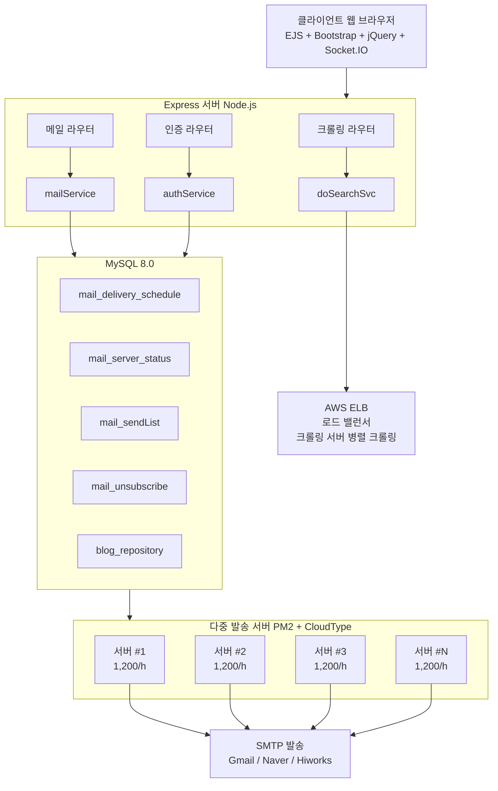

---
tags:
  - portfolio
Create at: 2025-12-18 
---

## 프로젝트 개요

### 네이버 인플루언서 상위노출 확률 기반 빅데이터 구축 및 이메일 마케팅 자동화 플랫폼

**프로젝트 기간**: 2022.12 ~ 2025.12 (약 3년, 지속적 운영 및 개선)
**개발 규모**: 약 71,000 라인
**주요 역할**: 풀스택 개발 (백엔드/프론트엔드 100% 단독 개발)

#### 비즈니스 배경

네이버 인플루언서 마케팅의 핵심은 상위노출입니다. 1,500만 개 이상의 블로그 중 유의미한 키워드에서 상위노출을 유지할 수 있는 인플루언서는 극소수입니다. 본 플랫폼은 다음 프로세스를 자동화합니다.

1. 상위노출 이력 수집 및 빅데이터 구축
2. 특정 계정의 카테고리별 노출 확률 분석
3. 일정 확률 이상 인플루언서에게 자동 이메일 발송
4. 광고주와 영향력 있는 인플루언서 연결

---

## 핵심 기술 선택 및 이유

### 1. Node.js 선택 이유

#### 기술적 선택 배경

대량의 이메일 발송과 웹 크롤링 작업을 동시에 처리해야 하는 요구사항 때문에 Node.js의 비동기 IO 모델이 적합했습니다. 또한 프론트엔드와 백엔드를 자바스크립트로 통일하여 개발 생산성을 높일 수 있었고, Puppeteer(크롤링), Nodemailer(이메일), Socket.IO(실시간) 등 필요한 라이브러리가 이미 성숙한 상태였습니다.

#### 성과

- 1인 개발자가 풀스택 개발 가능 (프론트/백엔드 컨텍스트 스위칭 최소화)
- 비동기 처리로 시간당 1,200건 이메일 발송 안정적 처리
- Puppeteer 통합으로 브라우저 자동화 크롤링 구현 (초기 버전)

---

### 2. MySQL 선택 이유

#### 기술적 선택 배경

이메일 발송 중복 방지를 위해 FOR UPDATE 락을 사용한 ACID 트랜잭션 보장이 필수적이었습니다. 발송 스케줄, 발송 이력, 수신거부, 서버 상태 등 복잡한 연관 관계를 관리하기 위해 관계형 데이터 모델이 필요했고, 검증된 데이터베이스를 사용하여 장애 발생 시 빠른 복구가 가능하도록 했습니다.

#### 성과

- FOR UPDATE 락을 활용한 분산 서버 환경에서 중복 발송 완벽 차단
- 트랜잭션으로 발송 실패 시 자동 롤백 (데이터 정합성 보장)
- Connection Pool(최대 10개)로 다중 서버 환경에서도 안정적 쿼리 처리

---

### 3. DB 폴링 방식 선택 이유

#### 기술적 선택 배경

초기 요구사항은 시간당 1,200건 이상 처리였고, 제한된 서버 자원으로 인해 추가 인프라 구축이 어려웠습니다. 이메일 발송은 실시간성보다 중복 방지와 안정성이 더 중요했기 때문에 메시지 큐 대신 DB 폴링 방식을 선택했습니다.

#### DB 폴링 방식 구현

여러 발송 서버가 3초마다 mail_delivery_schedule 테이블을 폴링하여 작업을 가져옵니다. 이때 FOR UPDATE 락을 사용하여 중복 할당을 방지합니다.

#### 장점

- 구현 단순: 기존 MySQL 인프라만으로 분산 처리 구현
- 서버 확장 용이: 새 서버 추가 시 자동으로 작업 분담 (별도 설정 불필요)
- 장애 복구 자동화: 서버 다운 시 heartbeat 중단 → 다른 서버가 자동 인계
- 트랜잭션 보장: ACID 특성으로 발송 중복 완벽 차단

#### 단점

- DB 부하: 3초마다 폴링 쿼리 발생
- 지연 시간: 최대 3초 지연 가능

#### 메시지 큐 대비 비교

DB 폴링 방식과 메시지 큐를 비교하면 다음과 같습니다

- 인프라 복잡도: DB 폴링은 기존 DB를 활용하므로 낮은 반면, 메시지 큐는 RabbitMQ/Kafka 등을 추가로 구축해야 하므로 높습니다.
- 트랜잭션 보장: DB 폴링은 FOR UPDATE로 쉽게 구현 가능하지만, 메시지 큐는 분산 트랜잭션 처리가 어렵습니다.
- 유지보수: DB 폴링은 단일 스토리지만 관리하면 되지만, 메시지 큐는 DB와 메시지 브로커를 모두 관리해야 하므로 복잡합니다.
- 실시간성: DB 폴링은 최대 3초 지연이 발생하지만, 메시지 큐는 즉시 처리 가능합니다.
- 비용: DB 폴링은 추가 비용이 없으나, 메시지 큐는 추가 서버 비용이 발생합니다.

#### 성과

- 3초 지연은 마케팅 이메일 발송에 무의미 (비즈니스 영향 없음)
- 단순한 아키텍처로 3년간 안정적 운영 (장애 최소화)
- 서버 추가만으로 선형 확장 가능 (예: 5대 서버 = 6,000건/시간)

---

### 4. 크롤링 시스템 아키텍처 변화

#### 4-1. 초기 아키텍처 (Puppeteer 단일 처리)

**구현 방식**:

- Puppeteer로 Chromium 브라우저 인스턴스 생성
- 네이버 블로그 검색 결과 페이지 순차 크롤링
- HTML 파싱 후 블로그 ID 추출

**문제점**:

- 키워드당 30~60초 소요 (브라우저 생성/종료 오버헤드)
- 단일 스레드 병목 현상
- 메모리 누수 위험 (브라우저 리소스 관리 복잡)

#### 4-2. 개선 아키텍처 (분산 크롤링 시스템)

#### 분산 크롤링 전환 배경

고객 요구사항으로 여러 키워드를 빠르게 동시에 수집할 필요가 있었습니다. 그러나 Puppeteer 순차 처리로는 대량 키워드를 처리할 수 없었고, 비용 효율을 위해 AWS ELB 기반 크롤링 서버를 외부 API로 분리하여 독립적으로 확장할 수 있도록 했습니다.

#### 개선 방식

Express 서버가 HTTP 요청으로 AWS ELB(로드 밸런서)에 작업을 전달하면, ELB가 여러 크롤링 서버(#1, #2, #3...)에 작업을 분산합니다. 각 크롤링 서버는 병렬로 크롤링을 수행하여 블로그 ID와 이메일 추출 결과를 반환합니다.

#### 병렬 처리 구현

- 동시성 제한 패턴: MAX_CONCURRENT_REQUESTS = 10
- 작업 단위를 블록 기반으로 분할
- Promise.all + Promise.race 조합으로 효율적 병렬 처리

#### 성과

- 키워드당 평균 5~15초로 단축 (기존 30~60초 대비 약 3배 속도 향상)
- 사용자 경험 개선: 실시간 진행률 추적 (Socket.IO 기반)
- 리소스 효율: 크롤링 서버 독립 배치로 메인 서버 부하 분리

---

### 5. 이메일 발송 최적화 전략

#### 5-1. 스팸 필터링 회피 전략

**문제점**:

- 하이웍스/네이버에서 단일 계정당 대량 발송 제한
- 단시간 내 많은 이메일 발송 시 스팸으로 간주되어 계정 차단

**해결 방안 1: 딜레이 순차 발송**

- node-schedule을 사용한 cron 기반 스케줄링
- 3초마다 1건 발송 (20건/분, 1,200건/시간)
- 즉시 발송과 예약 발송을 번갈아 처리 (우선순위 균형)

**해결 방안 2: 메일 본문 변조**

- 한글 문자 사이에 랜덤 문자 삽입 (스팸 필터 지문 회피)
- 링크 URL에 랜덤 쿼리스트링 추가 (매번 다른 URL로 인식)
- 보이지 않는 div 태그로 감싸 사용자에게는 영향 없음

**해결 방안 3: 시간대 제약 관리**

- DB에서 허용된 발송 시간대 조회 (일상 시간대만 발송)
- 비허용 시간대에는 작업 자동 종료 (스팸 의심 최소화)

#### 성과

- 3년간 스팸 차단율 최소화 (안정적 발송 유지)
- 네이버/하이웍스 제한 회피하면서도 대량 발송 구현
- 단일 서버 기준 시간당 1,200건 안정적 처리

---

#### 5-2. 다중 SMTP 제공자 지원

#### 다중 SMTP 지원 배경

특정 계정이 스팸 차단되었을 때 다른 제공자로 즉시 전환할 필요가 있었습니다. 또한 고객사별로 Gmail, Naver, Hiworks 등 다양한 이메일 계정을 사용하므로 유연한 SMTP 설정이 필요했습니다.

#### 구현 방식

- 발송 계정 이메일 도메인 파싱 후 동적 SMTP 설정 변경
- TLS 버전 강제 (minVersion: TLSv1.2) 로 보안 강화
- Nodemailer Transport 객체를 발송마다 새로 생성 (메모리 누수 방지)

#### 성과

- 계정 차단 시 수동 개입 없이 자동 전환
- 다양한 고객사 요구사항 수용 (유연한 SMTP 설정)

---

### 6. 분산 서버 헬스체크 (Heartbeat)

#### Heartbeat 메커니즘 구현 배경

다중 발송 서버 환경에서 장애 서버를 자동으로 감지할 필요가 있었습니다. 작업 중 서버가 다운되면 다른 서버가 작업을 인계받아야 했습니다.

#### 구현 방식

각 발송 서버는 10초마다 mail_server_status 테이블에 MAC 주소와 타임스탬프를 업데이트합니다. 서버 상태 모니터링 시스템은 last_update_time을 확인하여 30초 이상 업데이트되지 않은 서버를 비활성 상태로 처리합니다.

#### 장점

- 장애 복구 자동화: 서버 다운 시 다른 서버가 자동으로 작업 인계
- 실시간 모니터링: 관리자 페이지에서 활성 서버 목록 확인 가능 (Socket.IO)
- 신규 서버 자동 등록: 서버 추가 시 별도 설정 없이 자동 DB 등록

#### 성과

- 3년간 서버 장애로 인한 발송 누락 사고 없음
- 서버 확장 시 설정 파일 수정 불필요 (운영 편의성 향상)

---

## 시스템 아키텍처

### 전체 시스템 구성도

---

## 주요 기능

### 1. 캠페인 관리

- 메일 본문 템플릿 관리 (Quill.js 리치 텍스트 에디터)
- 검색 키워드 템플릿 관리
- 캠페인 그룹별 발송 통계

### 2. 발송 자동화

- 원클릭 발송 메일 할당 (캠페인별 자동 수신자 매칭)
- 예약 발송 (날짜/시간 지정 스케줄링)
- 중복 발송 방지 (mail_sendList 테이블 실시간 체크)
- 수신거부 필터링 (mail_unsubscribe 테이블 연동)

### 3. 발송 모니터링

- 열람 체크 (1x1 픽셀 이미지 트래킹)
- 읽은 비율 통계 (캠페인별 오픈율 집계)
- 서버 헬스 체크 (발송 봇 상태 실시간 모니터링)
- 에러 로깅 (Winston 일별 로그 파일 생성)

### 4. 네이버 스팸 대응

- 발송 메일 자동 변경 (특정 계정 스팸 차단 시 다른 계정으로 전환)
- 딜레이 순차 발송 (3초 간격 발송)
- 랜덤 문자열 삽입 (메일 본문 지문 변조)

### 5. 클라우드 기반 분산 배치

- CloudType 활용 (발송 봇 다중화)
- 자동 서버 등록 (신규 서버 기동 시 DB에 MAC 주소 기반 자동 등록)
- 로드 밸런싱 (DB 폴링 방식으로 자동 작업 분산)

---

## 개발 기간별 주요 변경 이력

### 초기 개발 단계 (2022.12 ~ 2023)

- Node.js + Express 백엔드 구축
- Puppeteer 기반 크롤링 시스템 구현
- MySQL 데이터베이스 설계
- Nodemailer 이메일 발송 시스템 구축

### 성능 최적화 단계 (2024)

- 분산 크롤링 시스템 도입 (AWS ELB 연동)
- 병렬 처리 최적화 (동시성 제한 패턴)
- DB 매칭 방식 개선 (blog_repository 테이블 연동)
- 이미지 리사이징 기능 추가 (Quill.js 최적화)

### 안정화 단계 (2025)

- 실시간 진행률 추적 (Socket.IO + progressMap)
- 동시 요청수 제한 추가 (MAX_CONCURRENT_REQUESTS)
- UI/UX 개선 (리뷰나비 닉네임 표시 등)
- 버그 수정 및 안정성 강화

---

## 성과 및 임팩트

### 정량적 성과

- **발송 처리량**: 단일 서버 기준 시간당 1,200건 (3초 간격 발송)
- **크롤링 속도**: 병렬 처리 도입 후 약 3배 향상 (30~60초 → 5~15초)
- **시스템 안정성**: 3년간 장애로 인한 발송 누락 사고 없음

### 기술적 성과

- **분산 시스템 구현**: DB 폴링 기반 다중 서버 협업 구현 (추가 인프라 없음)
- **스팸 필터링 회피**: 3년간 안정적 발송 유지 (랜덤 문자열 + 딜레이 전략)
- **병렬 처리 최적화**: 동시성 제한 패턴으로 리소스 효율적 활용
- **장애 복구 자동화**: Heartbeat 메커니즘으로 서버 다운 시 자동 인계

### 비즈니스 임팩트

- **자동화 효율**: 수동 메일 발송 대비 작업 시간 약 90% 단축 (추정)
- **타겟팅 정확도**: 상위노출 이력 기반 데이터로 고품질 인플루언서 선별
- **확장성**: 클라우드 기반 서버 추가로 발송량 선형 확장 가능
- **운영 편의성**: 서버 추가 시 설정 파일 수정 불필요 (자동 등록)

---

## 기술 스택 요약

### 백엔드

- Node.js 18+, Express.js 4.x, MySQL 8.0
- Nodemailer, node-schedule, Socket.IO

### 크롤링

- Puppeteer 22.x (초기), AWS ELB (현재)
- Axios, Cheerio, fetchWithRetry

### 프론트엔드

- EJS, Bootstrap 5, jQuery 3.x
- DataTables, Quill.js 2.x, Webpack 5

### 운영

- PM2 (fork 모드), Winston 3.x
- CloudType (분산 배포)

---
