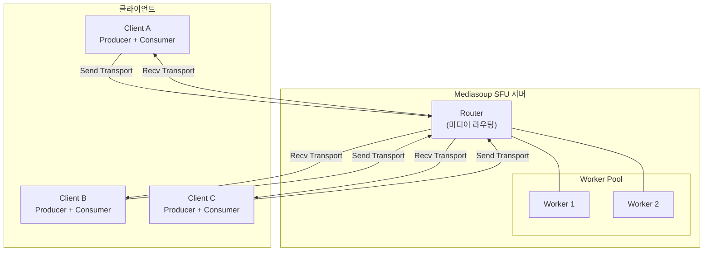

# WebRTC 실시간 협업 서비스
Mediasoup SFU 기반 N:M 화상 회의 시스템. 화이트보드, 채팅, 화면 공유 통합.

| 항목  | 내용                          |
| --- | --------------------------- |
| 기간  | 2025.10 ~ 2026.01 (약 2.5 개월) |
| 역할  | 100% 단독 개발                  |

---

## 시스템 아키텍처

---

## 핵심 성과
| 지표 | Before (P2P) | After (SFU) |
|------|--------------|-------------|
| 동시 접속 | 4 명 | **100 명** |
| 클라이언트 CPU | 80% | **15%** |
| E2E Latency | - | **200ms 미만** |

---

## 기술 스택
| 영역 | 기술 |
|------|------|
| Frontend | Next.js 16, React 19, shadcn/ui |
| Backend | Express, Socket.io |
| 미디어 | Mediasoup v3 (SFU) |
| 화이트보드 | Fabric.js v6 |

---

## 핵심 챌린지
### 1. Consumer N² 스케일링 문제
SFU 아키텍처에서 참가자 수 증가 시 Consumer 가 기하급수적으로 증가하는 문제 해결

### 2. Producer 라이프사이클 설계
카메라 + 화면 공유 동시 사용 시 Producer 충돌 문제 해결

### 3. 이중 병목 구조 발견
부하 테스트에서 네트워크 병목이 CPU 병목을 가리는 현상 분석

→ 상세 내용: [[핵심 챌린지]]

---

## 문서
| 문서                                                              | 설명        |
| --------------------------------------------------------------- | --------- |
| [[핵심 챌린지]]                                                      | 기술 문제 해결  |
| [[docs/Architecture\|Architecture]]                             | 상세 아키텍처   |
| [[docs/Socket Event Specification\|Socket Event Specification]] | 이벤트 명세    |
| [[docs/Load Test Report\|Load Test Report]]                     | 부하 테스트 결과 |

---

## 참고 자료
- [Mediasoup](https://mediasoup.org/documentation/v3/)
- [Socket.io](https://socket.io/docs/v4/)
- [Fabric.js](http://fabricjs.com/docs/)
