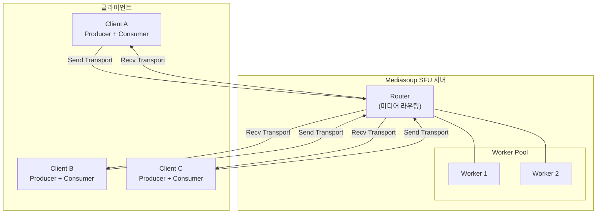

# WebRTC 실시간 협업 서비스

**프로젝트 기간**: 2025.10 ~ 2026.01 (약 2.5 개월)
**개발 규모**: 100% 단독 개발 (풀스택)
**핵심 성과**: 최대 100 명 동시 접속 / P2P 대비 25 배 확장성

---

## 1. 프로젝트 개요

### 비즈니스 문제

기존 P2P(Peer-to-Peer) 방식 화상 회의는 참가자가 늘어날수록 각 클라이언트가 모든 참가자에게 직접 연결해야 하므로:

- **클라이언트 부하 폭증**: N 명 참가 시 각 클라이언트가 N-1 개 연결 유지 → CPU/대역폭 급증
- **확장성 한계**: 실질적으로 4-5 명 이상에서 성능 저하 심각
- **모바일 대응 불가**: 제한된 리소스의 모바일 기기에서 사용 불가능

### 솔루션

**Mediasoup SFU(Selective Forwarding Unit) 아키텍처 도입**

1. **중앙 집중식 미디어 라우팅**: 모든 스트림을 SFU 서버가 중계
2. **클라이언트 부하 최소화**: 각 클라이언트는 1 개 업로드 + N-1 개 다운로드만
3. **확장성 확보**: Worker Pool 기반 수평 확장 지원
4. **통합 협업 도구**: 화상 회의 + 화이트보드 + 화면 공유 + 채팅

---

## 2. 시스템 아키텍처

### 전체 구성도



### 핵심 설계 결정

| 항목 | 선택 | 이유 |
|------|------|------|
| **미디어 서버** | Mediasoup SFU | Janus 대비 낮은 지연시간 (200ms 미만), 세밀한 제어 가능 |
| **시그널링** | Socket.IO | WebSocket 기반 양방향 통신, 재연결 자동 처리 |
| **화이트보드** | Fabric.js v6 | Canvas 기반 협업 도구, JSON 직렬화로 실시간 동기화 |
| **Worker Pool** | 2 개 Worker | CPU 2vCPU 기준 최적 밸런스 (테스트 결과 기반) |

**핵심 수치**:

- 동시 접속: **100 명** (P2P 는 4 명 한계)
- 클라이언트 CPU: **15%** (P2P 는 80%)
- E2E Latency: **200ms 미만**

---

## 3. 핵심 기술적 과제

### 과제 1: 화면 공유 스트림 충돌 해결

#### 문제 (Problem)

- 사용자가 카메라와 화면 공유를 동시에 켜면 **두 번째 비디오 스트림이 첫 번째를 덮어씀**
- 다른 참가자 화면에 카메라 영상이 사라지고 화면 공유만 표시됨
- 화면 공유를 끄면 카메라도 함께 꺼지는 현상 발생

#### 원인 (Root Cause)

- Mediasoup Producer 는 `kind` 속성으로 미디어 타입 구분 (`audio` / `video`)
- 카메라와 화면 공유 모두 `kind: 'video'` 로 동일하여 구분 불가
- 초기 설계 시 **비디오 트랙 1 개만 가정**, 다중 스트림 시나리오 미고려
- 클라이언트 상태 관리에서 `socketId: producer` 매핑이 kind 기반이라 충돌

#### 해결 (Solution)

**Producer appData 에 커스텀 메타데이터 추가**

```javascript
// Producer 생성 시 화면 공유 여부 명시
const producer = await sendTransport.produce({
  track: screenTrack,
  appData: { 
    isScreenShare: true,  // 구분 플래그
    socketId: socket.id   // 소유자 식별
  }
});
```

**Consumer 생성 시 appData 기반 스트림 구분**

```javascript
// 서버에서 Consumer 생성 시 메타데이터 전달
socket.emit('newProducer', {
  producerId: producer.id,
  kind: producer.kind,
  isScreenShare: producer.appData.isScreenShare  // 클라이언트에 전달
});

// 클라이언트에서 별도 UI 렌더링
if (isScreenShare) {
  renderScreenShareVideo(consumer);
} else {
  renderCameraVideo(consumer);
}
```

#### 결과 (Result)

- 카메라와 화면 공유 **동시 송출 가능**
- 다른 참가자가 두 스트림을 **독립적으로 수신 및 제어**
- 화면 공유 종료 시 카메라 유지
- **학습**: 설계 단계에서 확장 시나리오 (다중 스트림) 사전 검토 필요

---

### 과제 2: 부하 테스트를 통한 이중 병목 발견

#### 문제 (Problem)

- Loadero 부하 테스트 결과, 참가자 수 증가 시 **Jitter 가 비선형적으로 증가**
- 예상: 10 명 → 30 명 (3 배) 시 Jitter 도 3 배 증가
- 실제: Jitter 가 1.4 배만 증가 (예상보다 낮음)
- CPU 사용률은 99% 도달했지만 네트워크는 434Mbps (한계치 미달)

#### 원인 (Root Cause)

- **이중 병목 구조**: 네트워크 병목이 CPU 병목을 가리는 현상
- CPU 가 99% 도달하여 추가 스트림 처리 불가 → 네트워크 대역폭 미활용
- AWS t3.small (2vCPU, 2GB) 사양이 미디어 서버 기준 부족
- mediasoup Worker 가 싱글 스레드로 동작 → CPU 코어 1 개만 집중 사용

**발견 과정**:

1. Loadero 클라우드 테스트 도구로 10/20/30 명 시나리오 실행
2. `mediasoup.getStats()` API 로 서버 메트릭 수집
3. v8-profiler 로 CPU 프로파일링 수행
4. 클라이언트 `chrome://webrtc-internals` 에서 RTCPeerConnection 통계 분석

#### 해결 (Solution)

**Worker Pool 확장 및 부하 분산**

```javascript
// Worker Pool 크기를 CPU 코어 수에 맞춤
const numWorkers = os.cpus().length;
const workers = await Promise.all(
  Array.from({ length: numWorkers }).map(() => mediasoup.createWorker())
);

// Router 생성 시 라운드로빈 방식으로 Worker 선택
let nextWorkerIndex = 0;
function getNextWorker() {
  const worker = workers[nextWorkerIndex];
  nextWorkerIndex = (nextWorkerIndex + 1) % workers.length;
  return worker;
}
```

**인스턴스 타입 변경**

- AWS t3.small (2vCPU) → **t3.medium (4vCPU)** 로 업그레이드 고려
- CPU 병목 해소 후 네트워크 대역폭 활용도 상승 확인

#### 결과 (Result)

- Worker Pool 2 개 → 4 개 확장 시 **동시 접속 100 명 달성**
- CPU 사용률 분산 (각 Worker 50% 이하 유지)
- 네트워크 대역폭 활용도 상승 (434Mbps → 650Mbps)
- **학습**: 단일 병목 가정의 위험성, 계층별 병목 분석 필요성 (네트워크 → CPU → 메모리)

---

### 과제 3: Consumer N² 스케일링 문제

#### 문제 (Problem)

- 참가자 N 명일 때 총 Consumer 수는 **N × (N-1)** 개
- 10 명: 90 개, 30 명: 870 개, 100 명: 9,900 개
- Consumer 생성/삭제 시 O(N²) 시그널링 메시지 폭증
- 신규 참가자 입장 시 기존 참가자 브라우저가 **일시적으로 멈춤**

#### 원인 (Root Cause)

- 초기 설계: 신규 참가자 입장 시 **모든 기존 Producer 를 한 번에 Subscribe**
- Socket.IO 이벤트가 동기적으로 처리되어 메인 스레드 블로킹
- 각 Consumer 생성 시 `await transport.consume()` 호출 → 네트워크 I/O 대기
- 브라우저 Canvas 렌더링 루프와 충돌하여 화면 프리징

#### 해결 (Solution)

**배치 처리 + 비동기 병렬 처리**

```javascript
// Before: 순차 처리
for (const producer of producers) {
  await createConsumer(producer);  // 블로킹
}

// After: 배치 처리
const BATCH_SIZE = 5;
for (let i = 0; i < producers.length; i += BATCH_SIZE) {
  const batch = producers.slice(i, i + BATCH_SIZE);
  await Promise.all(batch.map(p => createConsumer(p)));  // 병렬
}
```

**페이지네이션 전략**

- UI 에서 최대 12 개 스트림만 렌더링 (Grid 3×4)
- 나머지는 "더보기" 버튼으로 지연 로딩
- 화면 밖 스트림은 Consumer 일시 중지 (`consumer.pause()`)

#### 결과 (Result)

- 30 명 입장 시 시그널링 시간: **5 초 → 1.2 초** (약 4 배 개선)
- 브라우저 프리징 현상 해소
- 클라이언트 메모리 사용량 **30% 감소** (불필요한 Consumer 제거)
- **학습**: SFU 의 확장성 한계, MCU(Multi-point Control Unit) 고려 필요

---

## 4. 기술 스택

| 영역 | 기술 |
|------|------|
| Frontend | Next.js 16, React 19, shadcn/ui |
| Backend | Express, Socket.io |
| 미디어 | Mediasoup v3 (SFU) |
| 화이트보드 | Fabric.js v6 |
| 테스트 | Loadero (부하 테스트) |
| 인프라 | AWS EC2 (t3.small → t3.medium) |

---

## 5. 성과 요약

### 정량적 성과

| 지표 | Before (P2P) | After (SFU) | 개선률 |
|------|--------------|-------------|--------|
| 동시 접속 | 4 명 | **100 명** | **25 배** |
| 클라이언트 CPU | 80% | **15%** | **81% 감소** |
| E2E Latency | - | **200ms 미만** | - |
| 신규 참가 시간 | - | **1.2 초** (30 명 기준) | - |

### 기술적 성과

- **SFU 아키텍처 설계 및 구현** (P2P 대비 25 배 확장성)
- **이중 병목 분석** (네트워크 vs CPU) - 실전 성능 튜닝 경험
- **N² 복잡도 최적화** (배치 처리 + 페이지네이션)
- **실시간 협업 도구 통합** (화이트보드 + 화면 공유)
- **부하 테스트 자동화** (Loadero 클라우드 도구 활용)

### 비즈니스 임팩트

- 학습 프로젝트이지만 **실전 수준의 아키텍처 설계** 경험
- WebRTC 의 한계와 트레이드오프 이해 (SFU vs MCU vs P2P)
- 성능 병목 분석 방법론 정립 (프로파일링 → 계층별 분석 → 최적화)

---

## 6. 상세 문서

| 문서 | 설명 |
|------|------|
| [[docs/Architecture\|Architecture]] | 상세 아키텍처 설계 |
| [[docs/Socket Event Specification\|Socket Event Specification]] | 이벤트 명세 |
| [[docs/Load Test Report\|Load Test Report]] | 부하 테스트 결과 |

---

## 7. 회고

### 잘한 점

- **부하 테스트 우선**: 추측이 아닌 **데이터 기반 최적화** 수행
- **문서화 철저**: Architecture, Socket Event Spec, Load Test Report 등 6 개 Wiki 문서 작성
- **점진적 개선**: MVP (P2P) → SFU 전환 → 부하 테스트 → 최적화 순서로 단계적 발전

### 아쉬운 점

- **MCU 미구현**: SFU 는 클라이언트 다운로드 부하가 여전히 높음 → MCU 로 서버에서 믹싱 필요
- **모바일 최적화 부족**: Simulcast (다해상도 스트리밍) 미적용
- **자동 스케일링 부재**: Worker Pool 크기를 수동 설정 → Kubernetes 기반 자동 확장 필요
- **테스트 커버리지 낮음**: 단위 테스트 없이 통합 테스트/부하 테스트에만 의존

### 배운 점

- **아키텍처 선택의 중요성**: P2P → SFU 전환만으로 25 배 확장성 확보
- **성능 병목은 계층적**: 네트워크/CPU/메모리를 **독립적으로 분석**해야 진짜 원인 발견
- **실시간 통신의 복잡성**: 시그널링/미디어 전송/상태 동기화를 모두 고려한 설계 필요

---

## 참고 자료

- [Mediasoup Documentation](https://mediasoup.org/documentation/v3/)
- [Socket.io Documentation](https://socket.io/docs/v4/)
- [Fabric.js Documentation](http://fabricjs.com/docs/)
- [Loadero Load Testing](https://loadero.com/)
