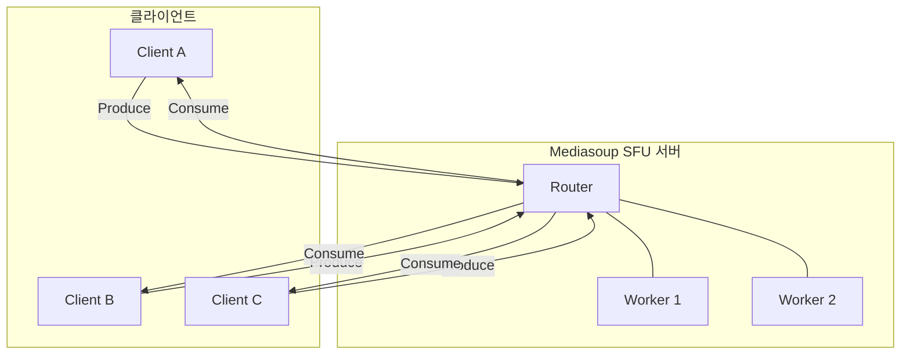
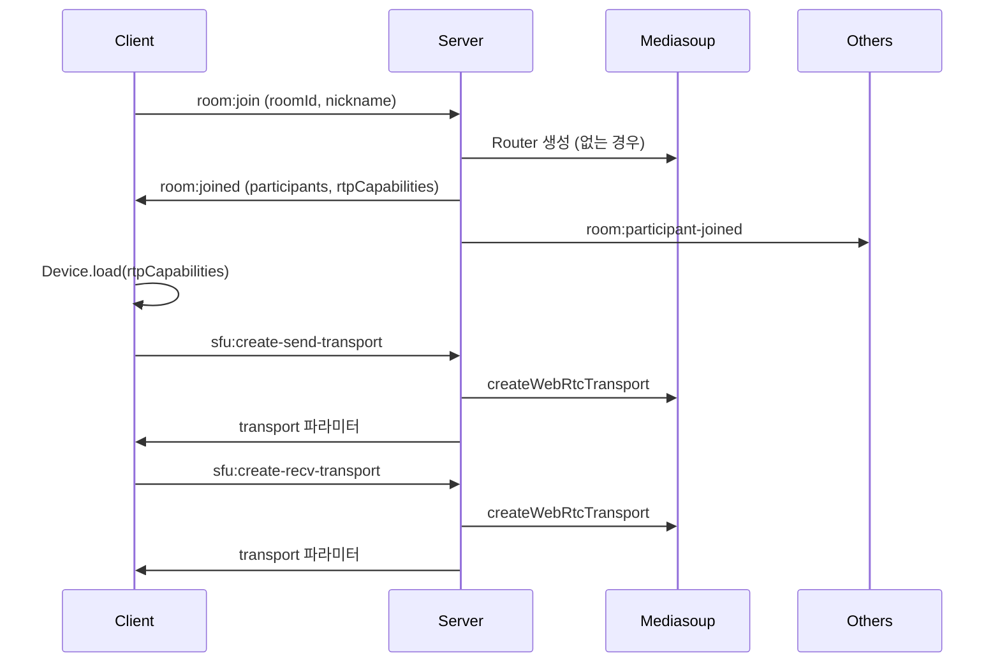
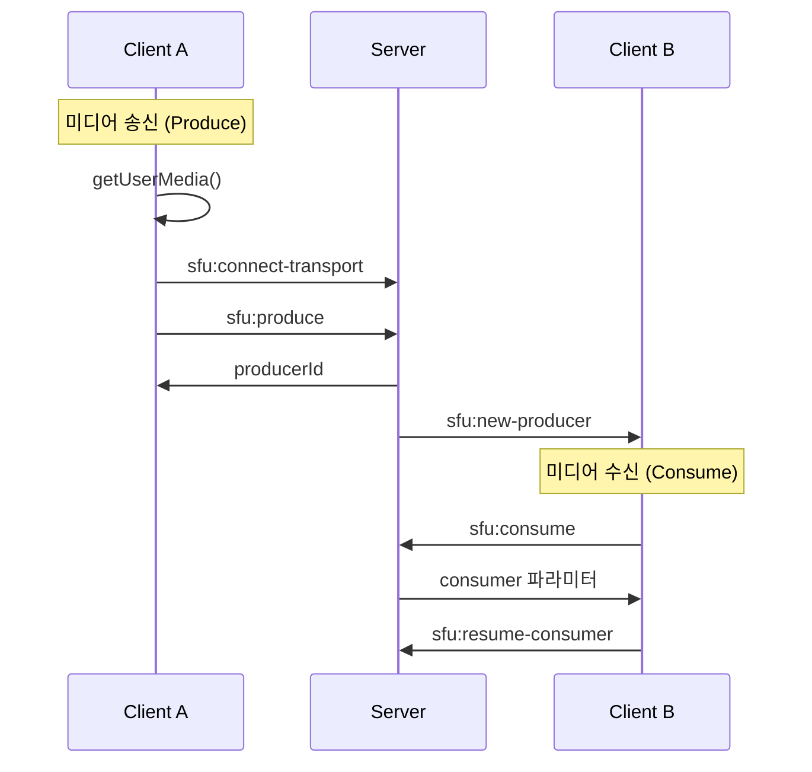
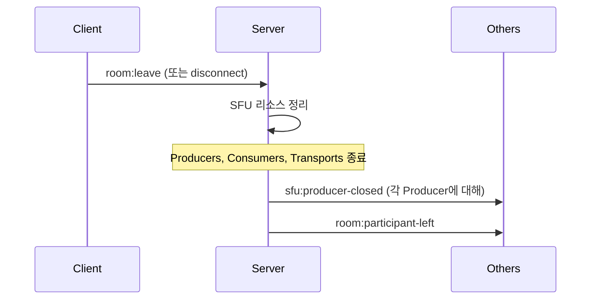

# Architecture

Mediasoup SFU 기반 실시간 협업 서비스의 상세 아키텍처 문서.

---

## 1. 아키텍처 개요

### 1.1 SFU (Selective Forwarding Unit)

SFU는 클라이언트로부터 미디어를 받아 다른 클라이언트에게 선택적으로 전달하는 중계 서버입니다.



### 1.2 P2P vs SFU vs MCU 비교

| 방식 | 클라이언트 부하 | 서버 부하 | 적합 인원 |
|------|----------------|----------|----------|
| P2P (Mesh) | 높음 (N-1개 연결) | 없음 | 2~4명 |
| **SFU** | 낮음 (1개 연결) | 중간 (중계만) | **5~100명** |
| MCU | 낮음 | 높음 (인코딩/믹싱) | 대규모 |

### 1.3 Mediasoup 리소스 계층

```
Worker (C++ 프로세스)
└── Router (Room 단위)
    └── Transport (참가자 단위)
        ├── Producer (미디어 송신)
        └── Consumer (미디어 수신)
```

| 리소스 | 설명 | 생성 단위 |
|--------|------|----------|
| **Worker** | C++ 미디어 처리 프로세스 | CPU 코어 수 |
| **Router** | 미디어 라우팅 컨테이너 | Room 1개당 1개 |
| **Transport** | WebRTC 연결 | 참가자당 Send/Recv 2개 |
| **Producer** | 미디어 송신 핸들 | 트랙당 1개 (audio/video) |
| **Consumer** | 미디어 수신 핸들 | 원격 Producer당 1개 |

---

## 2. 서버 아키텍처

### 2.1 계층 구조

```
계층 1 - HTTP/WebSocket 계층
├── Express.js (HTTP 요청 처리)
└── Socket.io (WebSocket 연결)

계층 2 - 시그널링 계층
├── roomHandler (방 관리)
├── sfuHandler (SFU 시그널링)
├── chatHandler (채팅)
└── whiteboardHandler (화이트보드)

계층 3 - 미디어 관리 계층
├── RoomManager (방 상태)
└── MediasoupManager (Mediasoup 리소스)

계층 4 - 미디어 처리 계층
└── Mediasoup Worker (C++ 프로세스)
```

### 2.2 디렉토리 구조

```
server/
├── index.js                    # 서버 진입점
├── config/
│   └── mediasoupConfig.js      # Mediasoup 설정
├── handlers/                   # Socket.io 이벤트 핸들러
│   ├── roomHandler.js          # 방 입장/퇴장
│   ├── sfuHandler.js           # SFU 시그널링 (15개 이벤트)
│   ├── chatHandler.js          # 채팅
│   └── whiteboardHandler.js    # 화이트보드
└── managers/
    ├── RoomManager.js          # 방 상태 관리
    └── mediasoup/              # Mediasoup 리소스 관리
        ├── WorkerPoolManager.js
        ├── RouterManager.js
        ├── TransportManager.js
        ├── ProducerManager.js
        ├── ConsumerManager.js
        └── ResourceCleaner.js
```

### 2.3 Manager-Handler 패턴

```
Handler (이벤트 처리)          Manager (상태 관리)
────────────────────          ───────────────────
roomHandler      ──────────→  RoomManager
sfuHandler       ──────────→  MediasoupManager
chatHandler      ──────────→  (RoomManager 참조)
whiteboardHandler ─────────→  (RoomManager 참조)
```

**책임 분리**:
- **Handler**: Socket.io 이벤트 수신 및 응답
- **Manager**: 비즈니스 로직 및 상태 관리

### 2.4 MediasoupManager 분할 구조

MediasoupManager는 6개의 하위 Manager로 분할됩니다:

| Manager | 책임 |
|---------|------|
| **WorkerPoolManager** | Worker 풀 생성 및 라운드 로빈 할당 |
| **RouterManager** | Room별 Router 생성/조회/삭제 |
| **TransportManager** | Transport 생성/연결/종료 |
| **ProducerManager** | Producer 생성/일시정지/재개/종료 |
| **ConsumerManager** | Consumer 생성/재개/종료 |
| **ResourceCleaner** | 리소스 정리 및 메모리 누수 방지 |

---

## 3. 클라이언트 아키텍처

### 3.1 계층 구조

```
계층 1 - UI 컴포넌트 계층
├── VideoGrid, VideoPlayer
├── ChatPanel, ChatMessage
├── WhiteboardCanvas
└── ControlBar, SettingsPanel

계층 2 - 상태 관리 계층
├── RoomContext (방 상태)
├── MediaContext (미디어 상태)
├── SFUContext (SFU 연결 상태)
├── ChatContext (채팅 상태)
└── WhiteboardContext (화이트보드 상태)

계층 3 - 서비스 계층
├── SocketService (Socket.io 래퍼)
├── SFUService (mediasoup-client 래퍼)
├── ChatService (채팅 로직)
└── WhiteboardService (화이트보드 로직)

계층 4 - 라이브러리 계층
├── mediasoup-client
├── socket.io-client
└── fabric.js
```

### 3.2 Context-Service 패턴

```
Context (상태)              Service (로직)
─────────────              ─────────────
RoomContext     ←──────→   SocketService
MediaContext    ←──────→   SFUService
SFUContext      ←──────→   (mediasoup-client)
ChatContext     ←──────→   ChatService
WhiteboardContext ←─────→  WhiteboardService
```

**규칙**: Service는 Context에서만 인스턴스화

### 3.3 디렉토리 구조

```
├── app/                    # Next.js App Router
│   ├── layout.js
│   ├── page.js
│   └── room/[roomId]/page.js
│
├── components/             # UI 컴포넌트
│   ├── room/               # 방 관련 (13개)
│   ├── chat/               # 채팅 UI
│   ├── whiteboard/         # 화이트보드 UI
│   └── ui/                 # shadcn/ui 컴포넌트
│
├── contexts/               # React Context
│   ├── RoomContext.js
│   ├── MediaContext.js
│   ├── SFUContext.js
│   ├── ChatContext.js
│   ├── WhiteboardContext.js
│   └── media/              # MediaContext 분할 (4개 훅)
│
├── services/               # 비즈니스 로직
│   ├── SocketService.js
│   ├── SFUService.js
│   ├── ChatService.js
│   ├── WebRTCService.js
│   ├── WhiteboardService.js
│   └── sfu/                # SFUService 분할 (5개 Manager)
│       ├── SFUSocketAdapter.js
│       ├── SFUDeviceManager.js
│       ├── SFUTransportManager.js
│       ├── SFUProducerManager.js
│       └── SFUConsumerManager.js
│
└── hooks/                  # 커스텀 훅
    ├── useRoom.js
    ├── useSFU.js
    ├── useChat.js
    └── useWhiteboard.js
```

### 3.4 SFUService 분할 구조

SFUService는 5개의 하위 Manager로 분할됩니다:

| Manager | 책임 |
|---------|------|
| **SFUSocketAdapter** | Socket.io 이벤트 래핑 |
| **SFUDeviceManager** | mediasoup Device 초기화 및 관리 |
| **SFUTransportManager** | Send/Recv Transport 관리 |
| **SFUProducerManager** | Producer 생성/일시정지/재개/종료 |
| **SFUConsumerManager** | Consumer 생성/재개/종료 |

---

## 4. 데이터 플로우

### 4.1 방 참가 플로우



### 4.2 미디어 송수신 플로우



### 4.3 참가자 퇴장 플로우



---

## 5. 설정 파일

### 5.1 mediasoupConfig.js

```javascript
// Worker 설정
workerSettings: {
  logLevel: 'warn',
  rtcMinPort: 10000,
  rtcMaxPort: 10100
}

// Router 설정 (지원 코덱)
mediaCodecs: [
  { mimeType: 'audio/opus' },
  { mimeType: 'video/VP8' },
  { mimeType: 'video/H264' }  // Safari 호환성
]

// Transport 설정
webRtcTransportOptions: {
  listenIps: [{ ip: '0.0.0.0', announcedIp: 'PUBLIC_IP' }],
  enableUdp: true,
  enableTcp: true,
  preferUdp: true
}
```

### 5.2 환경별 설정

| 환경 | listenIps | logLevel | Worker 수 |
|------|-----------|----------|----------|
| 개발 | 127.0.0.1 | debug | 1개 |
| 프로덕션 | 실제 서버 IP | warn | CPU 코어 수 |

---

## 6. 에러 처리 및 복구

### 6.1 Worker 장애 복구

1. Worker의 'died' 이벤트 감지
2. 영향받은 Room의 참가자들에게 재연결 요청
3. 새 Worker 생성하여 풀에 추가
4. 참가자들이 재연결하면 새 Worker에서 Router 생성

### 6.2 Transport 연결 실패 처리

1. Transport의 'icestatechange' 이벤트 모니터링
2. 'failed' 상태 감지 시 클라이언트에 알림
3. 클라이언트가 Transport 재생성 요청
4. 기존 Transport 리소스 정리 후 새로 생성

### 6.3 재연결 전략

1. Socket.io 재연결 (자동)
2. Device RTP Capabilities 재조회
3. Transport 재생성
4. Producer 재생성
5. Consumer 재생성

---

## 7. 성능 고려사항

### 7.1 Consumer N² 스케일링

```
참가자 수 × (참가자 수 - 1) × 2(비디오+오디오) = Consumer 수

예시:
- 10명: 10 × 9 × 2 = 180개 Consumer
- 30명: 30 × 29 × 2 = 1,740개 Consumer
```

### 7.2 최적화 전략

1. **Active Speaker 모드**: 현재 발언자의 영상만 고화질 전송
2. **Simulcast**: 여러 해상도로 인코딩하여 수신자별 적응
3. **Consumer 지연 생성**: 화면에 보이는 참가자만 구독

---

## 8. 참고 자료

- [Mediasoup 공식 문서](https://mediasoup.org/documentation/v3/)
- [mediasoup-client 문서](https://mediasoup.org/documentation/v3/mediasoup-client/)
- [WebRTC 공식 문서](https://webrtc.org/)
