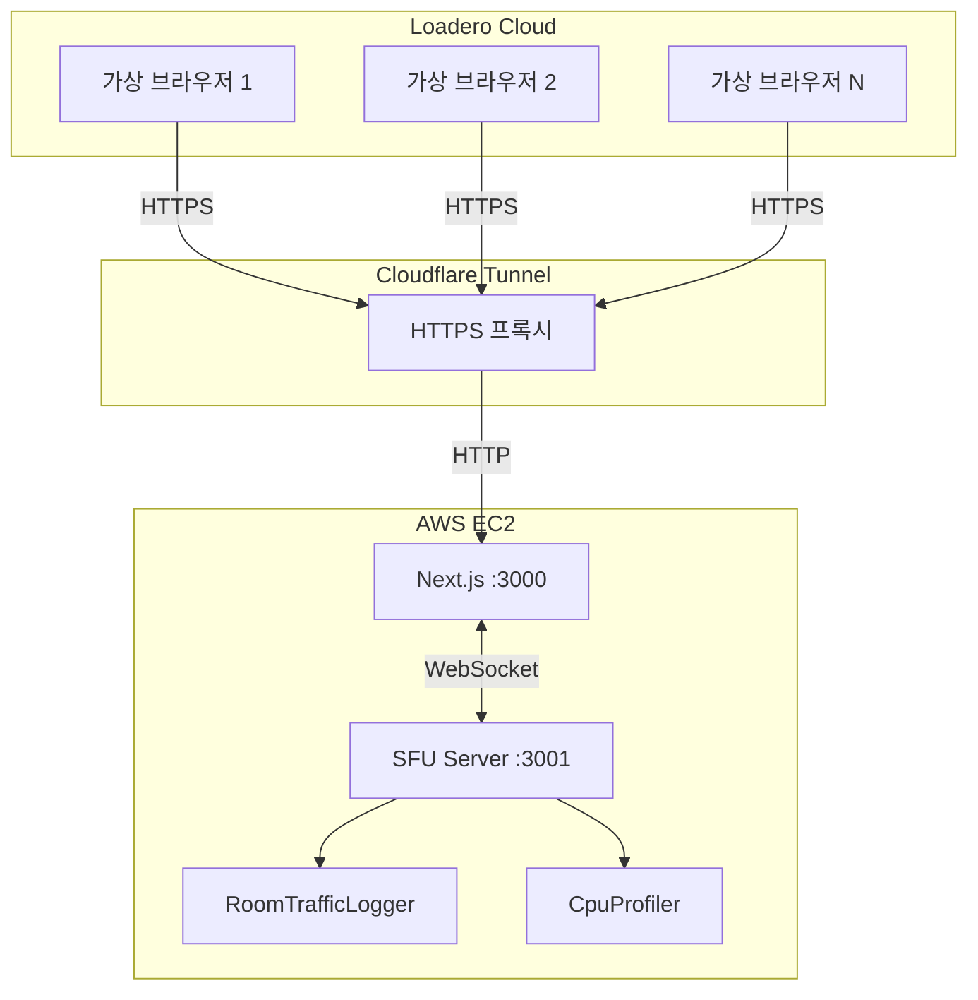

# Load Testing Tools

WebRTC SFU 부하 테스트 환경 구성 가이드.

---

## 1. 테스트 도구 개요

### 1.1 사용 도구

| 도구 | 역할 | 비고 |
|------|------|------|
| **Loadero** | 원격 WebRTC 부하 테스트 | SaaS (https://loadero.com) |
| **RoomTrafficLogger** | 서버측 트래픽 로깅 | 커스텀 유틸리티 |
| **CpuProfiler** | Node.js CPU 프로파일링 | v8-profiler-next 기반 |

### 1.2 테스트 구성도



---

## 2. Loadero

### 2.1 로컬 테스트의 한계

프로젝트 초기에는 Puppeteer 기반 로컬 부하 테스트(`tests/load-test/`)를 시도했으나

- 클라이언트 수에 비례하여 Chrome 프로세스 급증
- 테스트 장비의 메모리 부족으로 유의미한 수치 측정 불가

→ 클라이언트 리소스 부하를 분산하기 위해 클라우드 SaaS(Loadero)로 전환.

### 2.2 선택 이유

- **실제 브라우저 사용**: Headless Chrome으로 실제 WebRTC 연결
- **지역 분산 테스트**: 여러 리전에서 동시 접속 시뮬레이션
- **메트릭 수집**: WebRTC 내부 통계 (Jitter, RTT, 패킷 손실) 자동 수집
- **녹화/스크린샷**: 테스트 세션 영상 기록 가능

### 2.3 테스트 시나리오 구성

1. **Loadero 프로젝트 생성**
2. **테스트 스크립트 작성** (JavaScript)
   - 방 URL 접속
   - 닉네임 입력
   - 카메라/마이크 권한 부여
   - 일정 시간 유지
3. **참가자 수/해상도 설정**
4. **테스트 실행 및 결과 확인**

### 2.4 HTTPS 요구사항

WebRTC `getUserMedia()` API는 **Secure Context (HTTPS)**에서만 동작합니다.

**해결 방법**: Cloudflare Tunnel 사용

```bash
# Cloudflare Tunnel 설치 및 실행
cloudflared tunnel --url http://localhost:3000
```

**제약사항**:
- Cloudflare Tunnel은 UDP 미지원
- WebRTC 미디어가 **RTP over TCP**로 전송됨
- UDP 대비 높은 지연과 Jitter 발생

> 테스트 결과의 Jitter 수치는 TCP fallback 영향을 받습니다.
> 프로덕션 환경(UDP 사용)에서는 더 나은 성능이 예상됩니다.

---

## 3. 서버측 모니터링 도구

### 3.1 RoomTrafficLogger

방 단위 트래픽 세션을 로깅하는 커스텀 유틸리티.

**수집 메트릭**:
- 동시 접속자 수, Transport/Producer/Consumer 수
- CPU 사용률, 메모리 사용량
- 수신/송신 트래픽 (MB, Mbps)
- 패킷 손실률, Jitter, RTT

**로그 경로**: `./logs/traffic/traffic-YYYY-MM-DD.log`

**출력 예시**:
```
========== 세션 종료: 2025-12-23T15:30:00+09:00 ==========
방 ID: test-room
세션 ID: sess-1703312400000-test-room
---
[세션 요약]
- 세션 지속 시간: 664초
- 최대 동시 참가자: 10명
- 최대 동시 Consumer: 176
[리소스 사용량]
- 최대 CPU 사용률: 50%
- 최대 메모리 사용량: 256 MB
[트래픽 통계]
- 총 수신: 34,388 MB (평균 434 Mbps)
[품질 지표]
- 패킷 손실률: 0%
- 평균 Jitter: 2144ms
- 평균 RTT: 166ms
```

### 3.2 CpuProfiler

v8-profiler-next 기반 Node.js CPU 프로파일링 도구.

**기능**:
- 세션 단위 CPU 프로파일 수집
- Chrome DevTools에서 Flame Graph 분석 가능

**로그 경로**: `./logs/profile/cpu-*.cpuprofile`

**분석 방법**:
1. Chrome DevTools 열기 (F12)
2. Performance 탭 → Load Profile 클릭
3. `.cpuprofile` 파일 선택
4. Flame Chart에서 병목 구간 분석

---

## 4. 테스트 실행 체크리스트

### 4.1 사전 준비

```bash
# 1. 서버 시작
npm run server:dev

# 2. 프론트엔드 시작
npm run dev

# 3. Cloudflare Tunnel 시작 (Loadero 테스트 시)
cloudflared tunnel --url http://localhost:3000
```

### 4.2 모니터링 확인

```bash
# 실시간 SFU 상태 확인
curl http://localhost:3001/sfu/stats | jq .

# 헬스 체크
curl http://localhost:3001/health
```

### 4.3 결과 수집

```bash
# 트래픽 로그 확인
cat ./logs/traffic/traffic-*.log

# CPU 프로파일 목록
ls ./logs/profile/*.cpuprofile
```

---

## 5. 참고 자료

- [Loadero 공식 문서](https://docs.loadero.com/)
- [Cloudflare Tunnel 문서](https://developers.cloudflare.com/cloudflare-one/connections/connect-apps/)
- [Chrome DevTools Performance 분석](https://developer.chrome.com/docs/devtools/performance/)
