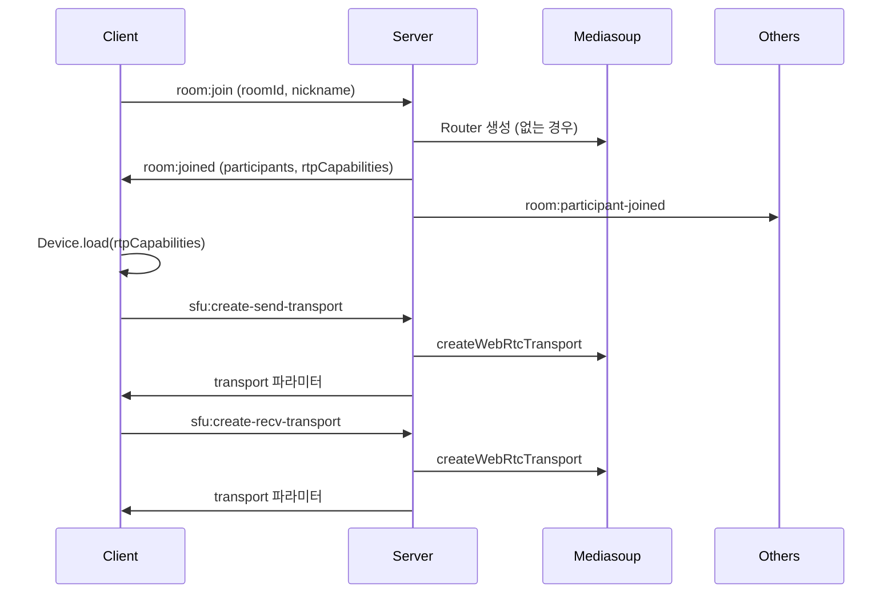
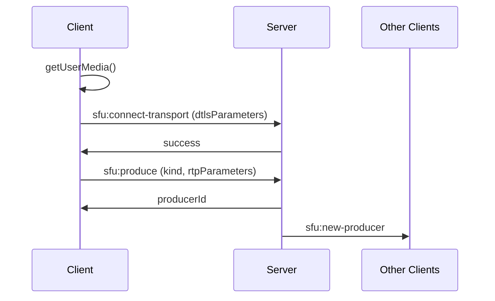
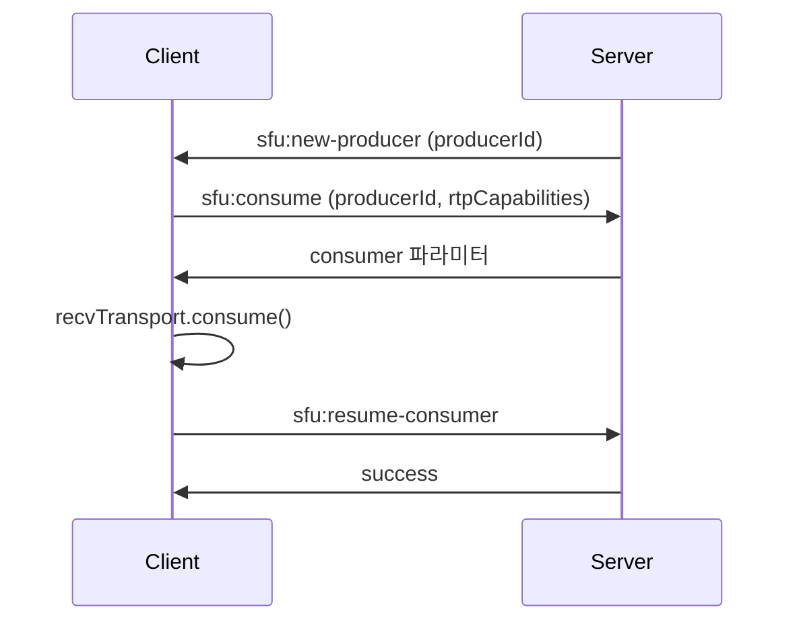
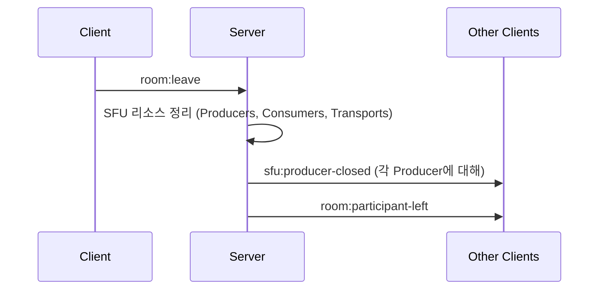

# Socket Event Specification
Socket.io 기반 시그널링 프로토콜 명세서.

SFU(Mediasoup) 아키텍처 기반, 최대 100 명 참가자 지원.

---

## 목차
1. [방 관리 (Room)](#1-방-관리-room)
2. [SFU 시그널링](#2-sfu-시그널링)
3. [채팅 (Chat)](#3-채팅-chat)
4. [화이트보드 (Whiteboard)](#4-화이트보드-whiteboard)
5. [에러 처리](#5-에러-처리)
6. [시퀀스 다이어그램](#6-시퀀스-다이어그램)

---

## 1. 방 관리 (Room)
### 1.1 방 참가
#### `room:join`
**방향**: 클라이언트 → 서버

```javascript
// 요청
socket.emit("room:join", {
  roomId: "abc123",
  nickname: "홍길동"
}, callback);

// 응답 (성공)
{
  success: true,
  participants: [
    { socketId: "socket1", nickname: "김철수", isHost: true },
    { socketId: "socket2", nickname: "이영희", isHost: false }
  ],
  hostSocketId: "socket1",
  rtpCapabilities: { /* Mediasoup Router RTP Capabilities */ }
}

// 응답 (실패)
{
  error: "ROOM_FULL",
  message: "방 정원(100명)이 초과되었습니다"
}
```

#### `room:joined` (브로드캐스트)
**방향**: 서버 → 클라이언트 (방의 다른 참가자들)

```javascript
{
  socketId: "socket3",
  nickname: "박민수",
  isHost: false
}
```

### 1.2 방 퇴장
#### `room:leave`
**방향**: 클라이언트 → 서버

```javascript
socket.emit("room:leave", { roomId: "abc123" });
```

#### `room:participant-left` (브로드캐스트)
**방향**: 서버 → 클라이언트 (방의 다른 참가자들)

```javascript
{
  socketId: "socket3",
  nickname: "박민수"
}
```

### 1.3 호스트 변경
#### `room:host-changed` (브로드캐스트)
**방향**: 서버 → 클라이언트 (방의 모든 참가자)

```javascript
{
  newHostSocketId: "socket2",
  newHostNickname: "이영희"
}
```

---

## 2. SFU 시그널링
### 2.1 연결 수립 단계
#### `sfu:get-router-rtp-capabilities`
**방향**: 클라이언트 → 서버
**목적**: Mediasoup Device 초기화에 필요한 코덱 정보 조회

```javascript
// 요청
socket.emit("sfu:get-router-rtp-capabilities", {
  roomId: "abc123"
}, callback);

// 응답
{
  rtpCapabilities: {
    codecs: [
      { mimeType: "audio/opus", ... },
      { mimeType: "video/VP8", ... }
    ],
    headerExtensions: [...]
  }
}
```

### 2.2 Transport 생성
#### `sfu:create-send-transport`
**방향**: 클라이언트 → 서버
**목적**: 미디어 송신용 WebRTC Transport 생성

```javascript
// 요청
socket.emit("sfu:create-send-transport", {
  roomId: "abc123"
}, callback);

// 응답
{
  id: "transport-uuid-123",
  iceParameters: { /* ICE 파라미터 */ },
  iceCandidates: [ /* ICE 후보 목록 */ ],
  dtlsParameters: { /* DTLS 파라미터 */ }
}
```

#### `sfu:create-recv-transport`
**방향**: 클라이언트 → 서버
**목적**: 미디어 수신용 WebRTC Transport 생성

```
// 요청 및 응답 형식은 sfu:create-send-transport와 동일
```

#### `sfu:connect-transport`
**방향**: 클라이언트 → 서버
**목적**: Transport DTLS 연결 수립

```javascript
// 요청
socket.emit("sfu:connect-transport", {
  transportId: "transport-uuid-123",
  dtlsParameters: { /* 클라이언트 DTLS 파라미터 */ }
}, callback);

// 응답
{ success: true }
```

### 2.3 미디어 송신 (Produce)
#### `sfu:produce`
**방향**: 클라이언트 → 서버
**목적**: Producer 생성 (비디오/오디오 트랙 송신 시작)

```javascript
// 요청
socket.emit("sfu:produce", {
  transportId: "transport-uuid-123",
  kind: "video",  // "audio" | "video"
  rtpParameters: { /* RTP 파라미터 */ },
  appData: {
    isScreenShare: false,
    nickname: "홍길동"
  }
}, callback);

// 응답
{
  id: "producer-uuid-456"
}
```

#### `sfu:new-producer` (브로드캐스트)
**방향**: 서버 → 클라이언트 (방의 다른 참가자들)
**목적**: 새로운 Producer 생성 알림

```javascript
{
  producerId: "producer-uuid-456",
  producerSocketId: "socket3",
  kind: "video",
  appData: {
    isScreenShare: false,
    nickname: "홍길동"
  }
}
```

#### `sfu:pause-producer` / `sfu:resume-producer`
**방향**: 클라이언트 → 서버
**목적**: Producer 일시정지/재개 (음소거, 비디오 끄기)

#### `sfu:close-producer`
**방향**: 클라이언트 → 서버
**목적**: Producer 종료 (카메라 완전 끄기)

### 2.4 미디어 수신 (Consume)
#### `sfu:get-producers`
**방향**: 클라이언트 → 서버
**목적**: 방의 다른 참가자들의 Producer 목록 조회

#### `sfu:consume`
**방향**: 클라이언트 → 서버
**목적**: Consumer 생성 (다른 참가자의 미디어 수신)

```javascript
// 요청
socket.emit("sfu:consume", {
  roomId: "abc123",
  producerId: "producer-uuid-111",
  rtpCapabilities: { /* 클라이언트 RTP Capabilities */ }
}, callback);

// 응답
{
  id: "consumer-uuid-789",
  producerId: "producer-uuid-111",
  kind: "video",
  rtpParameters: { /* RTP 파라미터 */ }
}
```

#### `sfu:resume-consumer`
**방향**: 클라이언트 → 서버
**목적**: Consumer 재개 (Consumer 는 기본 일시정지 상태로 생성됨)

---

## 3. 채팅 (Chat)
### 3.1 메시지 전송
#### `chat:message`
**방향**: 클라이언트 ↔ 서버 (양방향)

```javascript
// 요청
socket.emit("chat:message", {
  roomId: "abc123",
  message: "안녕하세요!"
});

// 브로드캐스트
{
  socketId: "socket3",
  nickname: "홍길동",
  message: "안녕하세요!",
  timestamp: 1703657600000
}
```

---

## 4. 화이트보드 (Whiteboard)
### 4.1 그리기 이벤트
#### `whiteboard:event`
**방향**: 클라이언트 ↔ 서버 (양방향)

```javascript
// 요청 (그리기 이벤트)
socket.emit("whiteboard:event", {
  roomId: "abc123",
  type: "path:created",  // "object:modified", "object:removed", etc.
  data: { /* Fabric.js 객체 JSON */ }
});
```

### 4.2 스냅샷 요청
#### `whiteboard:snapshot:request` / `whiteboard:snapshot:response`
### 4.3 캔버스 초기화
#### `whiteboard:clear`
**방향**: 클라이언트 → 서버 (호스트만 가능)

---

## 5. 에러 처리
### 5.1 에러 코드
| 코드 | 설명 | 대응 방안 |
|------|------|----------|
| `ROOM_NOT_FOUND` | 존재하지 않는 방 | 방 재생성 또는 사용자에게 알림 |
| `ROOM_FULL` | 방 정원 (100 명) 초과 | 사용자에게 알림 |
| `INVALID_NICKNAME` | 유효하지 않은 닉네임 | 닉네임 재입력 요청 |
| `TRANSPORT_NOT_FOUND` | Transport 가 존재하지 않음 | Transport 재생성 |
| `PRODUCER_NOT_FOUND` | Producer 가 존재하지 않음 | Producer 재생성 |
| `CONSUMER_NOT_FOUND` | Consumer 가 존재하지 않음 | Consumer 재생성 |
| `INVALID_RTP_CAPABILITIES` | 지원하지 않는 코덱 | 클라이언트에 에러 표시 |
| `ALREADY_PRODUCING` | 이미 해당 종류의 Producer 존재 | 기존 Producer 종료 후 재생성 |
| `NOT_HOST` | 호스트 권한 필요 | 권한 에러 표시 |

### 5.2 에러 응답 형식
```javascript
{
  error: "ERROR_CODE",
  message: "상세 에러 메시지"
}
```

---

## 6. 시퀀스 다이어그램
### 6.1 방 참가 및 SFU 초기화


### 6.2 미디어 송신 (Produce)


### 6.3 미디어 수신 (Consume)


### 6.4 방 퇴장


---

## 7. 참고 사항
### 7.1 이벤트 접두사 규칙
| 접두사 | 용도 |
|--------|------|
| `room:` | 방 관리 (입장, 퇴장, 호스트 변경) |
| `sfu:` | SFU 시그널링 (Transport, Producer, Consumer) |
| `chat:` | 채팅 |
| `whiteboard:` | 화이트보드 |

### 7.2 P2P 시그널링 (제거됨)
다음 이벤트들은 SFU 전환으로 제거됨:

- `signal:offer` - SFU 가 중계하므로 불필요
- `signal:answer` - SFU 가 중계하므로 불필요
- `signal:ice-candidate` - Mediasoup Transport 가 처리

### 7.3 재연결 전략
네트워크 불안정 시 재연결 순서:

1. Socket.io 재연결 (자동)
2. `sfu:get-router-rtp-capabilities` 재조회
3. Transport 재생성 (`sfu:create-send/recv-transport`)
4. Producer 재생성 (`sfu:produce`)
5. Consumer 재생성 (`sfu:consume`)
