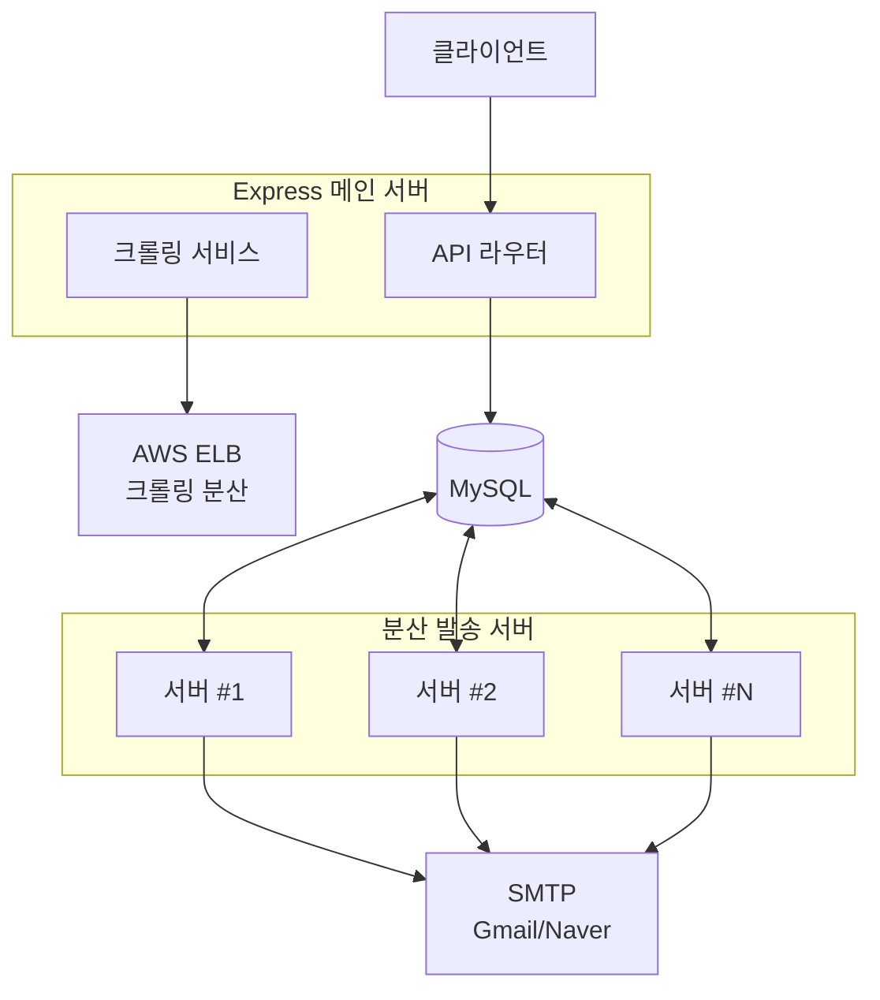
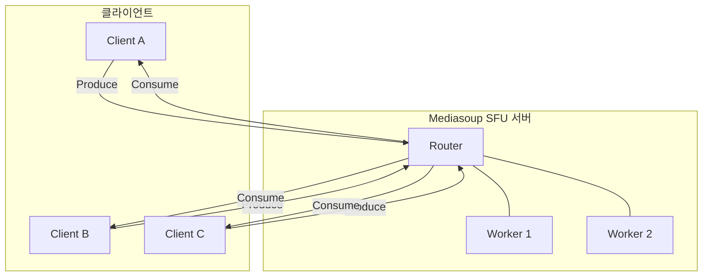

# 공원석
**Software Engineer** | 개발 3 년 + 산업 현장 운영 9 년

---

## Professional Summary
**백엔드 중심 풀스택 엔지니어**로, 24/7 산업 시스템 운영 9 년 경험을 바탕으로 
**설계 단계부터 장애 복구와 확장성을 고려**합니다.

**핵심 강점**:

- **분산 시스템 설계**: DB 폴링 기반 다중 서버 협업 구현, 3 년간 무중단 운영 (시간당 1,200 건 안정 처리)
- **실시간 통신 아키텍처**: WebRTC SFU 로 P2P 대비 25 배 확장성 향상 (4 명 → 100 명 동시 접속)
- **데이터 기반 의사결정**: 부하 테스트 및 프로파일링으로 병목 지점 분석, 근거 기반 최적화
- **운영 경험 기반 설계**: 글로벌 제약사 24/7 온콜 체제 경험 → 장애 예방과 자동 복구 중심 설계

---

## Technical Skills
**언어 & 런타임**
JavaScript (ES6+), Node.js 18+, Python 3

**프레임워크 & 라이브러리**
Express, Next.js, React, mediasoup (WebRTC SFU)

**데이터베이스 & 인프라**
MySQL, AWS (EC2/ELB), Docker, PM2

**개발 도구 & 협업**
Git, GitHub Actions, Jest, Winston, Socket.IO, Supabase

---

## Professional Experience
### 프리랜서 (2022.12 ~ 현재)
---

### 1. 네이버 인플루언서 마케팅 플랫폼
**풀스택 100% 단독 개발** | 2022.12 ~ 2025.12 (3 년)

상위노출 이력 기반 인플루언서 자동 발굴 및 이메일 마케팅 자동화 시스템

#### 시스템 아키텍처

#### 핵심 성과
|지표|결과|
|---|---|
|발송 안정성|**3 년간 중복 발송 0 건** (DB 폴링 + FOR UPDATE 락)|
|처리량|**1,200 건/시간**, 서버 추가 시 선형 확장|
|크롤링 속도|**3 배 향상** (30~60 초 → 5~15 초)|
|스팸 회피율|**99%+** (딜레이 발송 + 패턴 회피 전략)|

#### 핵심 기술 결정
**분산 처리 전략**
메시지 큐 대신 MySQL FOR UPDATE 락 선택 → 인프라 비용 0 원, ACID 트랜잭션 보장

**메일 발송 복구 자동화**
Heartbeat + FOR UPDATE 락 기반 장애 허용 설계 → 서버 다운 시 락 자동 해제, 타 서버가 작업 인계

**스팸 필터 회피**
딜레이 순차 발송 + 패턴 변조 + 다중 SMTP 동적 전환 → 3 년간 99%+ 안정 운영

→ 상세 내용: [[네이버 인플루언서 마케팅 플랫폼 구축]]

**기술 스택**: Node.js, Express, MySQL, Puppeteer, AWS ELB, Nodemailer, Socket.IO, Claude API

---

### 2. WebRTC 실시간 협업 서비스
**SFU 아키텍처 학습 프로젝트** | 최대 100 명 동시 접속

화상 채팅 + 실시간 화이트보드 + 화면 공유

#### 시스템 아키텍처

#### 핵심 성과
|지표|Before (P2P)|After (SFU)|
|---|---|---|
|동시 접속|4 명|**100 명**|
|클라이언트 CPU|80%|**15%**|
|E2E Latency|-|**200ms 미만**|

#### 기술적 챌린지
**[화면 공유 스트림 충돌 해결]**

- **문제**: 카메라와 화면 공유가 kind(video) 만으로 구분되지 않아 충돌
- **원인**: 초기 설계 시 비디오 트랙 1 개만 가정, 다중 스트림 시나리오 미고려
- **해결**: Producer appData 에 `isScreenShare` 플래그 추가, socketId 기반 스트림 구분
- **학습**: 설계 단계에서 확장 시나리오 (다중 스트림, 화면 공유) 사전 검토 필요

**[부하 테스트를 통한 이중 병목 발견]**

- **환경**: AWS t3.small (2vCPU, 2GB), Loadero 클라우드 부하 테스트
- **발견**: 참가자 3 배 증가 (10→30 명) 시 Jitter 가 1.4 배만 증가 (비선형)
- **분석**: 네트워크 병목 (434Mbps) 이 CPU 병목 (99%) 을 가림 → 이중 병목 구조
- **도구**: mediasoup `getStats()` API, v8-profiler, chrome://webrtc-internals
- **학습**: 단일 병목 가정의 위험성, 계층별 병목 분석 필요성

**기술 스택**: Node.js, mediasoup v3, Socket.IO, Next.js, React, Fabric.js

**문서화**: Architecture, Socket Event Spec, Load Test Report, Troubleshooting 등 Wiki 6 개 문서 작성

---

### 3. 밸류앤플러스 (계약직, 2025.05 ~ 2025.08)
비개발 직군 블로그 마케팅 업무 자동화 도구 6 종 개발

**주요 개발 내용**

- 키워드 추출기 (GPT API 연동, 블로그 카테고리별 연관 키워드 생성)
- 블로그 툴킷 (크롤링, 플레이스 리뷰 수집, Python → Node.js 포팅)
- 포스팅 재사용 검사기 (Next.js 웹앱, 관리자 대시보드, 사용자 통계)

**기술 스택**: Python, Node.js, Supabase, Next.js

---

### 비카누스 (2022.01 ~ 2022.11)
**컨테이너 환경 풀스택 경험**

**Fanuc 로봇 3D 스캐닝 시스템 유지보수**

- React, Spring Boot, Redis, Docker 기반 풀스택 환경
- 레거시 코드 분석 및 기능 개선
- 4 인 팀 협업 (Git 브랜치 전략, 코드 리뷰)

**DAQ 시계열 데이터 수집 시스템**

- InfluxDB 기반 시계열 데이터 관리
- Message Broker 활용 실시간 데이터 스트리밍
- React 대시보드 개발 (Grafana 연동)

---

## Side Projects
**젠더 리빌 사이트** | [Live](https://gender-reveal-theta.vercel.app/)
Cursor AI 활용 2 일 프로토타이핑, 4 종 애니메이션, 단태아/다태아 구분
**기술**: Next.js, shadcn/ui, TypeScript, Vercel

**대학 입시 컨설팅 사이트** | [Live](https://seedconsulting.co.kr/)
학생 관리 및 상담 예약 시스템
**기술**: Node.js, Express, MySQL

---

## Pre-Development Career (9 년)
**차별화 포인트**: 24/7 산업 시스템 운영 경험 → 설계 단계부터 안정성/장애 복구 고려

---

### 엔클로니 (2016.06 ~ 2020.12) - 4 년 6 개월
**제약 자동화 장비 시스템 엔지니어**

**시스템 안정성 경험**

- J&J, Pfizer 등 글로벌 제약사 생산 라인 24/7 온콜 대응
- 시스템 다운타임 1 분당 수천만원 손실 환경 → **장애 예방과 빠른 복구의 중요성** 체득
- GMP Validation 문서 (IQ/OQ/PQ) 작성 → **문서화와 절차 준수** 역량
- 정제/캡슐 비전 검사 장비 설치부터 인도까지 전 과정 관리

**글로벌 프로젝트 경험**

- 5 개국 출장 (인도, 말레이시아, 일본, 독일, 중국)
- 언어 장벽 환경에서 **기술 문서 기반 커뮤니케이션**
- 시차와 문화 차이 속 원격 협업 경험
- 국내외 전시회 참가 및 고객사 장비 데모 진행

→ 이 경험이 **분산 시스템 3 년 무중단 운영**과 **자동 장애 복구 메커니즘** 설계에 직접 기여

---

### ㈜오엔테크놀러지 (2013.07 ~ 2015.04) - 1 년 10 개월
**발전소 CMMS 및 진동 측정 장비 엔지니어**

**발전소 유지보수 관리 시스템 구축**

- 한국남부발전 삼척그린파워 CMMS(Computerized Maintenance Management System) 구축
- AMS(Asset Management System) 소프트웨어 관리
- 24/7 운영 환경의 **데이터 정합성/가용성 요구사항** 이해

**진동 측정 기반 예지보전**

- 한국수력원자력 각 발전소 진동측정장비 납품 및 기술지원
- 장비 고장 전 징후 탐지 → **모니터링과 알림 시스템**의 중요성 체득

→ 이 경험이 **MySQL 트랜잭션 설계**와 **Heartbeat 모니터링** 구현에 영향

---

### SK 커뮤니케이션즈 자회사 (2011.07 ~ 2013.06) - 2 년
**웹서비스 QA 엔지니어**

- SK 커뮤니케이션즈 싸이월드 앱 품질 테스트
- 네이트 메인 페이지 및 콘텐츠 사용자 통계 관리
- 웹 서비스 테스트 시나리오 설계 및 버그 리포팅

→ 이 경험이 **Jest 기반 테스트 자동화** 설계에 도움

---

## Education & Training
**빅데이터 분석 전문가 과정** | 2020.12 ~ 2021.04

- Python, R 기반 대용량 데이터 분석 및 시각화
- 머신러닝 기초 및 데이터 전처리 기법
- 전직 준비를 위한 기술 스택 전환 교육

---
