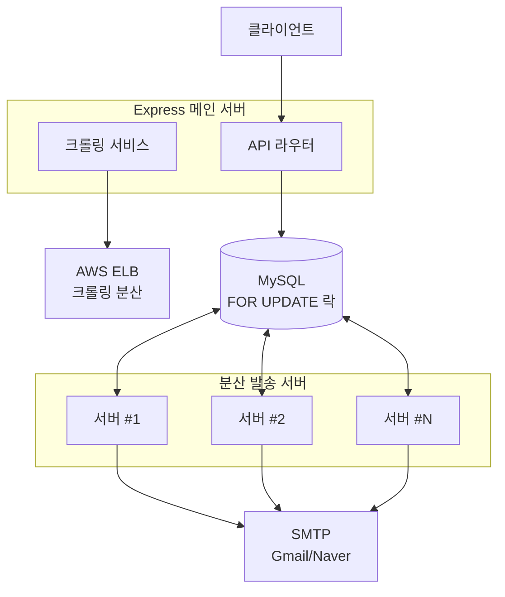
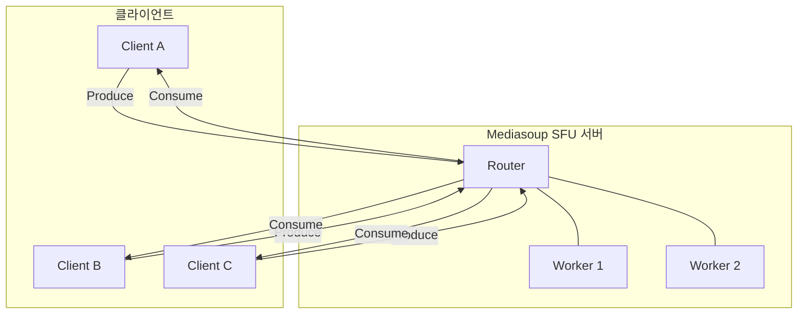

# 공원석

**Software Engineer** | 개발 3년 + 산업 현장 운영 9년

---

## Professional Summary

9년 산업 현장 운영 경험 기반, 설계 단계부터 안정성과 장애 복구를 고려하는 풀스택 엔지니어.

- **분산 시스템**: 시간당 1,200건 이메일 발송 플랫폼 3년 무중단 운영 (중복 발송 0건)
- **실시간 통신**: WebRTC SFU 서버 구축, P2P 대비 확장성 25배 향상 (4명 → 100명)
- **성능 최적화**: 부하 테스트 및 프로파일링 기반 병목 분석, 크롤링 속도 3배 개선

---

## Technical Skills

**주요 사용 기술**  
Node.js, Express, Next.js, React, MySQL, AWS EC2/ELB, Socket.IO

**경험 기술**  
WebRTC (mediasoup), Docker, PM2, Jest, Supabase, GitHub Actions

---

## Professional Experience

### 프리랜서 (2022.12 ~ 현재)

---

### 1. 네이버 인플루언서 마케팅 플랫폼

**풀스택 100% 단독 개발** | 2022.12 ~ 2025.12 (3년)

상위노출 이력 기반 인플루언서 자동 발굴 및 이메일 마케팅 자동화 시스템

#### 시스템 아키텍처

#### 핵심 성과

|지표|결과|
|---|---|
|발송 안정성|**3년간 중복 발송 0건** (DB 폴링 + FOR UPDATE 락)|
|처리량|**1,200건/시간**, 서버 추가 시 선형 확장|
|크롤링 속도|**3배 향상** (30~60초 → 5~15초)|
|스팸 회피율|**99%+** (딜레이 발송 + 본문 변조)|

#### 기술적 의사결정

**[분산 처리 전략]**

- 문제: 다중 서버 환경에서 동일 수신자 중복 발송 리스크
- 대안 비교: 메시지 큐(RabbitMQ) vs DB 폴링
- 선택: MySQL `FOR UPDATE` 락 기반 DB 폴링
- 이유: 추가 인프라 0원, ACID 트랜잭션 보장, 3초 지연은 마케팅 메일에 무의미

**[장애 복구 자동화]**

- 문제: 발송 중 서버 다운 시 작업 손실
- 해결: 10초 간격 Heartbeat, MAC 주소 기반 자동 등록
- 결과: 30초 이내 자동 작업 인계, 서버 추가 시 설정 파일 수정 불필요

**기술 스택**: Node.js, Express, MySQL, Puppeteer, AWS ELB, Nodemailer, Socket.IO, Claude API

---

### 2. WebRTC 실시간 협업 서비스

**SFU 아키텍처 학습 프로젝트** | 최대 100명 동시 접속

화상 채팅 + 실시간 화이트보드 + 화면 공유

#### 시스템 아키텍처

#### 핵심 성과

|지표|Before (P2P)|After (SFU)|
|---|---|---|
|동시 접속|4명|**100명**|
|클라이언트 CPU|80%|**15%**|
|E2E Latency|-|**200ms 미만**|

#### 기술적 챌린지

**[화면 공유 스트림 충돌]**

- 문제: 카메라와 화면 공유가 kind(video)만으로 충돌
- 원인: 초기 설계 시 비디오 트랙 1개만 가정
- 해결: appData에 `isScreenShare` 플래그 추가, socketId 기반 구분
- 학습: 다중 스트림 시나리오를 설계 단계에서 고려 필요

**[부하 테스트 이중 병목 발견]**

- 환경: AWS t3.small, Loadero 클라우드 테스트
- 발견: 참가자 3배 증가(10→30명) 시 Jitter 1.4배만 증가
- 분석: 네트워크 병목(434Mbps)이 CPU 병목(99%)을 가림
- 도구: mediasoup `getStats()` API, v8-profiler, chrome://webrtc-internals

**기술 스택**: Node.js, mediasoup v3, Socket.IO, Next.js, React, Fabric.js

**문서화**: Architecture, Socket Event Spec, Load Test Report 등 Wiki 6개 문서 작성

---

### 3. 밸류앤플러스 (계약직, 2025.05 ~ 2025.08)

비개발 직군 블로그 마케팅 업무 자동화 도구 6종 개발

- 키워드 추출기 (GPT API 연동)
- 블로그 툴킷 (크롤링, 플레이스 리뷰 수집)
- 포스팅 재사용 검사기 (Next.js 웹앱, 관리자 대시보드)

**기술 스택**: Python, Node.js, Supabase, Next.js

---

### 비카누스 (2022.01 ~ 2022.11)

**컨테이너 환경 풀스택 경험**

- Fanuc 로봇 3D 스캐닝 시스템 유지보수 (React, Spring Boot, Docker)
- DAQ 시계열 데이터 수집 시스템 (InfluxDB, Message Broker, Grafana)
- 4인 팀 협업 경험 (Git 브랜치 전략, 코드 리뷰)

---

## Side Projects

**젠더 리빌 사이트** | [Live](https://gender-reveal-theta.vercel.app/)  
Cursor AI 활용 2일 프로토타이핑, Next.js + shadcn/ui

**대학 입시 컨설팅 사이트** | [Live](https://seedconsulting.co.kr/)  
Node.js, Express, MySQL 풀스택

---

## Pre-Development Career (9년)

**차별화 포인트**: 24/7 산업 시스템 운영 경험 → 설계 단계부터 안정성/장애 복구 고려

### 엔클로니 (2016.06 ~ 2020.12)

**제약 자동화 장비 기술 엔지니어** - 글로벌 제약사(J&J, Pfizer) 비전 검사 시스템

- 24/7 온콜 체제, 생산 라인 긴급 장애 대응
- 글로벌 프로젝트: 인도, 말레이시아, 일본, 독일, 중국
- GMP Validation 문서(IQ/OQ/PQ) 작성

### ㈜오엔테크놀러지 (2013.07 ~ 2015.04)

**발전소 CMMS 구축** - 한국남부발전, 한국수력원자력

- 24/7 운영 환경의 데이터 정합성/가용성 요구사항 이해
- 진동 모니터링 기반 예지보전 시스템

---

## Education

**빅데이터 분석 전문가 과정** | 2020.12 ~ 2021.04  
Python, R 기반 대용량 데이터 분석

---

## Links

- GitHub: [프로젝트 링크]
- Blog: [기술 블로그 링크]